# Часть 11

Перед тем как продолжить, давайте посмотрим сможем ли мы убрать баг, который присутствует в **IDA** версии **6.8**, и который был исправлен в версии **6.9**, и которой у нас нет **:”\(** , чтобы увидеть присутствует ли у нас этот **БАГ**, откройте **IDA**, и на любой инструкции нажмите **ALT + M**, что равносильно размещению метки \(**JUMP → MARK POSITION**\), а затем на той же инструкции сделайте правый щелчок.

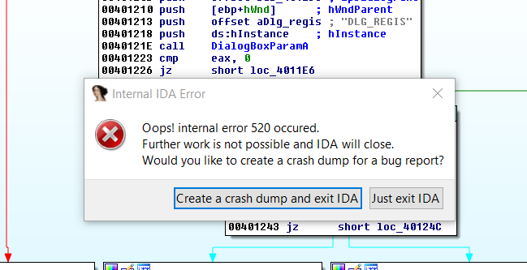

В интернете мы находим рецепт как исправить этот баг, давайте посмотрим как хорошо работает этот совет из интернета, для этого мы сделаем копии установленных исходных модулей.

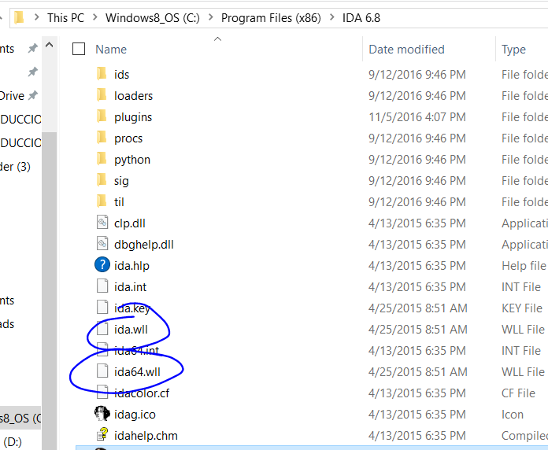

Давайте сперва найдём файл **IDA.WLL** и откроем его с помощью **HEX** редактора, например такого как **HXD**, с правами администратора.

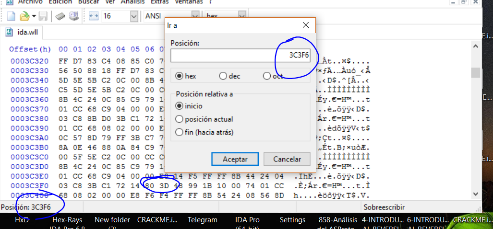

Мы меняем байты **80 3D** по смещению **0x3C3F6** на байты **EB 30**.

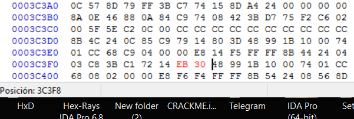

Скопируйте исходный файл в другое место, перед тем как его изменять, а затем переименуйте и скопируйте в ту же папку где хранятся бэкапы.

Другой файл это файл **IDA64.WLL** и мы делаем с ним то же самое, только теперь по адресу **0x41606** байты **80** **3D** меняем на байты **EB** **30**.

Давайте посмотрим присутствует ли сейчас наш **БАГ**.

Мы пробуем туже самую комбинацию **ALT + M** на инструкции, а затем делаем правый щелчок, **VOILA, IDA** не падает, я надеюсь, что всё будет продолжать функционировать без побочных эффектов.

Я не хотел перегружать вас всей теорией с самого начала, вот почему я смешал её с некоторыми упражнениями, но прежде чем продолжать, нам нужно увидеть определение ещё нескольких флагов, которые очень важны.

**ФЛАГИ

ФЛАГ ПЕРЕНОСА**

Мы уже видели что-то о ФЛАГЕ CARRY в предыдущей главе, он также активируется в операциях с беззнаковыми числами, когда результат отрицательный как в предыдущем случае или превышает в сумме максимальное возможное значение регистра, давайте посмотрим примеры в отладчике.

Если мы запустим **CRACKME.EXE** в **IDA** в режиме отладчика, то остановимся на **EP** и теперь мы изменим инструкцию на **ADD EAX, 1**.

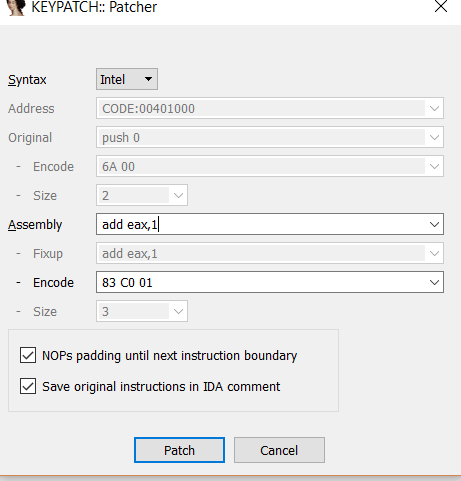

Давайте сделаем **EAX** равным **0xFFFFFFF** c помощью щелчка на пункте **MODIFY VALUE**.

Если блок функции испортится, то мы можем сделать правый щелчок на пункте **CREATE FUNCTION** в самом начале для того, чтобы всё было в порядке.

И трассируем инструкцию с помощью **F8**, для того, чтобы она исполнилась, мы видим, что флаг **CF** активируется когда превышается максимальное возможное значение.

То же самое случится, если мы напишем ниже **SUB** **EAX,** **EDX**.

Мы уже видели, что если уменьшить два положительных значения, то результат будет отрицательный, **CF** будет активироваться, потому что такое вычитание даёт ошибку.

Измените **EAX** на **0x25**, а **EDX** на **0x40**, и трассируем с помощью **F8**, чтобы видеть как активируется флаг **CF**.

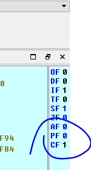

Был активирован флаг **CF**, чтобы выполнить снова это вычитание, нужно изменить **EIP**, для этого делаем правый клик и выбираем - **SET IP** на инструкции **SUB EAX, EDX** и меняем **EAX** на **0x100**.

Я выполняю инструкцию с помощью **F8**.

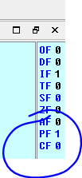

Флаг не был активирован. Как общее заключение, мы можем прийти к выводу, если активируется флаг **CF** в операции с беззнаковыми числами, это означает, что произошла ошибка любого типа.

**ФЛАГ ПЕРЕПОЛНЕНИЯ.**

Это похоже на предыдущий случай, но только для операций СО ЗНАКАМИ, мы меняем EIP на адрес инструкции ADD EAX,1 и вводим в EAX значение 0x7FFFFFFF.

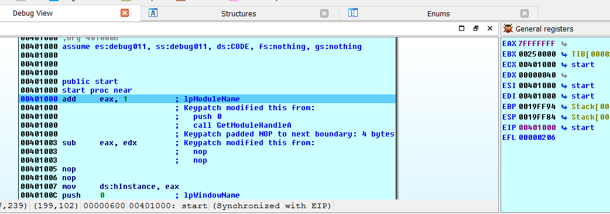

Если нажмём сейчас **F8**.

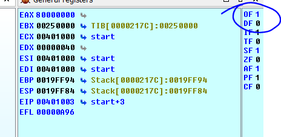

Мы видим, что был активирован **ФЛАГ OVERFLOW**, так как в операции со знаком происходит сложение единицы с максимальным положительным числом **0x7FFFFFFF,** поэтому результат получился максимально-отрицательным и результат суммы ложный.

Если я вычитаю **EAX** и **EDX** с использованием этих значений.

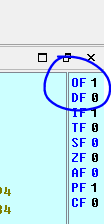

Флаг также активируется, потому что максимальное отрицательное число **0x80000000** минус **0x40** даёт нам очень большое положительное число, а это даёт ошибочный результат операции.

Следовательно, мы можем сделать заключение, что если **ФЛАГ OVERFLOW** активирован, это означает, что произошла ошибка при работе с операцией **СО ЗНАКОМ**.

**ФЛАГ ЗНАКА**

Это просто, он активируется, когда результат операции отрицательное значение в любом случае, флаг определяет только знак результата, он не видит правильный результат или нет при выполнении операции.

**0x8000000 + 0x1** находится в диапазоне отрицательных чисел, результат сложения равен **0x8000001**, поэтому активируется флаг **SF**, также мы видим, что флаг **OF** и флаг **CF** не активируются, когда нет ошибки в **БЕЗЗНАКОВОЙ** или **ЗНАКОВОЙ** операции.

Очевидно, что когда процессор выполняет инструкцию, которая работает с двумя регистрами, он не знает, **ЗНАКОВЫЕ** они или **НЕ ЗНАКОВЫЕ**, но мы знаем это за него, потому что мы видим следующие условные переходы, но процессор не знает об этом, поэтому в любой операции он будет оценивать инструкцию как если бы они были **БЕЗ ЗНАКА** и **СО ЗНАКОМ** в одно и тоже время и будет изменять необходимые флаги, поскольку условные переходы зависят от флагов, программа будет смотреть на результат флага **CF БЕЗ ЗНАКА** или флага **OF СО ЗНАКОМ** в соответствии с переходом, который существует, если например это **JB,** что есть переход **БЕЗ ЗНАКА** то будет учитываться только флаг **CF** и не будет учитываться флаг **OF** хотя они оба были изменены.

**ФЛАГ НУЛЯ**

Он не зависит от знака.

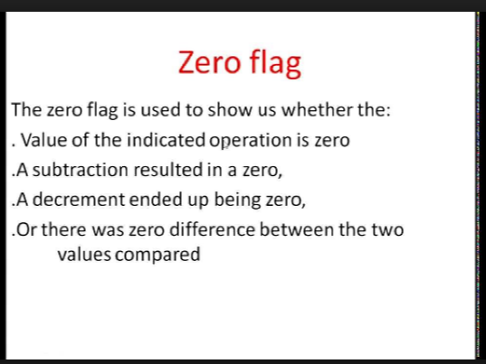

Он активируется, когда при сравнении \(что является внутренним вычитанием\) оба члена равны, и когда есть увеличение или уменьшение и результат равен нулю, или при вычитании, результат которого равен нулю.

Мы можем проверить.

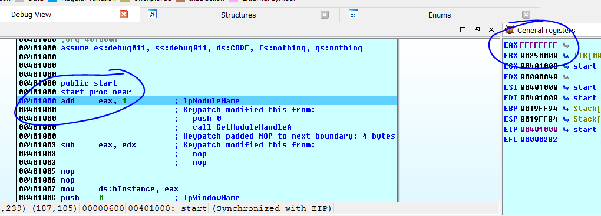

Я меняю **EAX** на значение **0xFFFFFFFF** и если я добавлю число **1** к нему, что тогда произойдёт?

Мы видим, что активируется флаг **ZF** так как результат операции нуль и если мы рассмотрим оба регистра как беззнаковые, также будет активирован флаг **CF**, так как превышено максимальное положительное значение, а флаг **OF** не будет активирован, потому что если оба регистра
**ЗНАКОВЫЕ**, то **-1** **+** **1** даёт нам нуль и нет никаких ошибок, также флаг **SF** не был активирован, так как результат не был отрицательным.

Эти флаги очень важны, давайте посмотрим, что случится если мы изменим следующий условный переход.

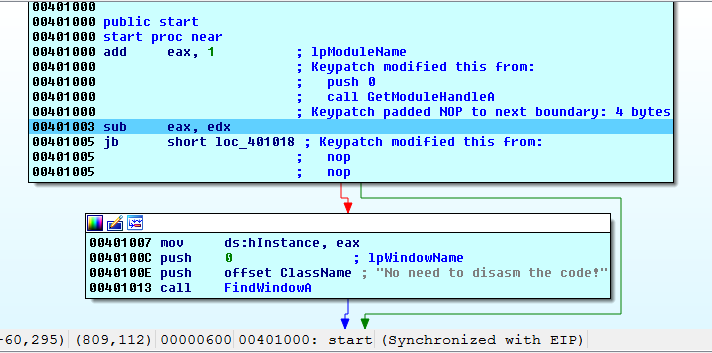

Я меняю инструкцию так, чтобы получилась инструкция **SUB EAX, EDX** и ниже пишу инструкцию **JB** **0x401018**.

Я делаю **EAX** равным **0x40**, а **EDX** равным **0x2** и исполняю инструкцию **SUB** с помощью **F8**.

Красная стрелка начинает мигать, потому что **EAX** больше чем **EDX**, следовательно переход не будет выполнен, но давайте посмотрим на флаги.

**JB** это **БЕЗЗНАКОВЫЙ** переход и он сработает если **ФЛАГ CF** активирован, так как флаг не был активирован, потому что операция была правильная между двумя положительными числами и результат оказался положительный, это означает, что первый операнд больше чем второй, следовательно, переход не произойдёт.

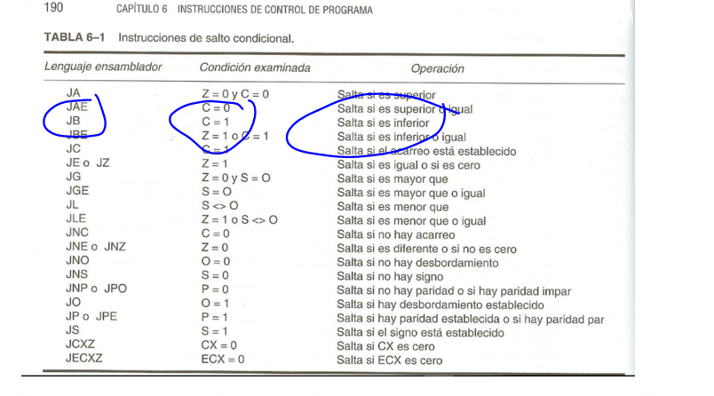

Но если мы изменим **EAX** на **0x40**, а **EDX** на **0x80** и я снова повторю вычитание.

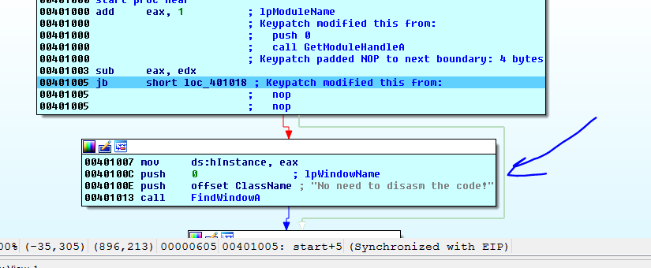

В этом случае, поскольку **EAX** меньше чем **EDX,** переход не будет совершен, но будет совершен переход на зеленую стрелку.

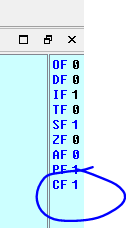

Так как **JB** смотрит на флаг **CF**, он будет осуществлять переход, потому что флаг активирован, если результат операции **БЕЗ ЗНАКА** дает отрицательное значение, то будет выдаваться ошибка.

Также активируется флаг **SF,** потому что получается отрицательный результат и флаг **OF** не активируется, потому что оба значения **БЕЗЗНАКОВЫЕ,** операция не выдаст такую ошибку, и **0x40** – **0x80**даёт отрицательный результат.

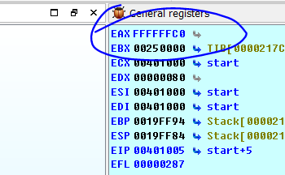

Переход **JB** зависит от состоянием флаг **CF,** но если я изменю его на **JL**.

В этом случае он изменяется и идёт на зелёную стрелку, потому что первое значение меньше чем второе, но на какой флаг смотрит переход **JL?**

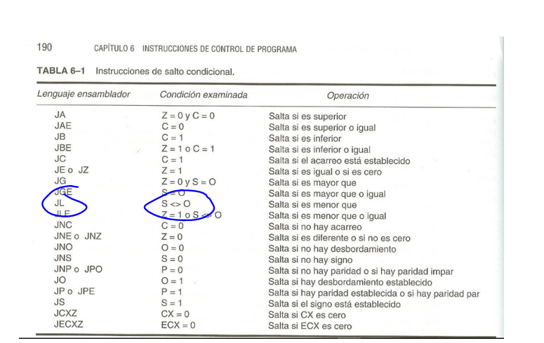

Мы видим, что переход **JL** сработает, если флаг **SF** не будет равен нулю, а в нашем случае он равен единице, поэтому он также не будет совершать переход, что логично, так как первый член меньше чем второй и инструкция **SUB** похожа на инструкцию сравнения **CMP**, только она сохраняет результат в отличие от **CMP**, таким образом если первый член меньше чем второй, то будет осуществлён переход.

Вывод этой главы заключается в том, что нет необходимости смотреть на флаги, чтобы узнать, что произойдет в условном переходе, это принадлежит внутренней функции, нам просто нужно знать, что если значения регистров равны JZ будет переходить, если значение регистра меньше и без знака, он будет переходить если это переход JB, если значение регистра меньше и со знаком, то будет переходить если это JL и так далее. Нам просто нужно смотреть третий столбец в знаковой и беззнаковой таблице, но хорошо изучить эти вещи более подробно.

Перевод на английский: **IvinsonCLS**
Перевод на русский с испанского+английского: **Яша\_Добрый\_Хакер\(Ростовский фанат Нарвахи\).**
Перевод специально для форума системного и низкоуровневого программирования - **WASM.IN**
