# Часть 16

Прежде чем продолжать углубляться в реверсинг, мы сделаем ещё одно упражнение по распаковке на другом примере. Этим файлом будет **UNPACKME\_ASPACK 2.2**.

Он относится к категории простых. Далее в курсе, мы вернёмся к расширенной распаковке после изучения других тем.

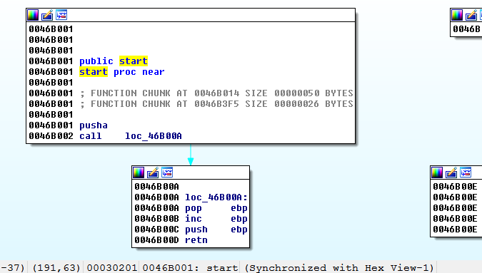

Здесь, видим **EP** упакованного файла. Она начинается с инструкции **PUSHAD**, которую мы, пока, не видели среди часто используемых инструкций, но её работа заключается в том, что она **ПОМЕЩАЕТ\(КЛАДЁТ\)** каждый регистр в стек, т.е.

Инструкция **PUSHAD** равносильна инструкции **PUSH**, т.е. сохраняет в стек регистры в следующем порядке:


Инструкция **POPAD** - это обратная инструкция. Она **ИЗВЛЕКАЕТ\(ВЫТАЛКИВАЕТ\)** содержимое стека, сохраняя его в регистрах в следующем порядке \(за исключением регистра **ESP**, который не меняется командой **POPAD**\):


В простых упаковщиках, большинство из них использовали инструкцию **PUSHAD** для сохранения первоначального состояния регистров при запуске программы и использовали **POPAD** для их восстановления, до перехода в **OEP**, для выполнения программы, уже распакованной в памяти.

Благодаря этому, была возможность легко найти **OEP**, используя метод **PUSHAD – POPAD**. Очевидно, в более современных упаковщиках, создатели заметили это и избегают использование этих инструкции.

Что такое метод **PUSHAD – POPAD**?

Прежде всего, мы должны выбрать отладчик и запустить его. Мы уже знаем как это сделать. Идём в меню **DEBUGGER → SELECT DEBUGGER** и выбираем пункт **LOCAL WIN32 DEBUGGER**.

Теперь, чтобы попрактиковаться, запустим отладчик через **PYTHON**. Вы можете вводить инструкции одну за другой в панели **PYTHON** или использовать плагин **IPYIDA**, который мы установили и которой более удобный. Я сделаю это именно так.

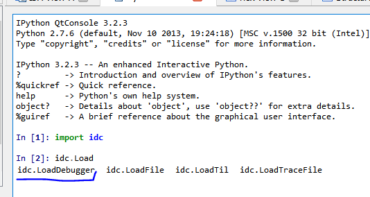

Видим, что если набрать **idc.Load** и нажать **TAB**, плагин скажет, что **idc.LoadDebugger** уже существует. Проверим это.

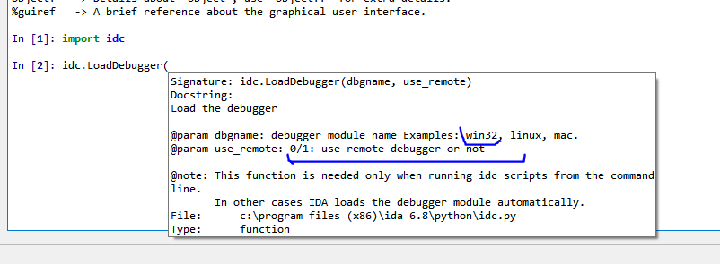

В нашем случае, мы должны выбрать **WIN32** и **0**, для локального отладчика\(**1** используется для удаленного отладчика\).

Проверим это. Для этого вводим такую команду.

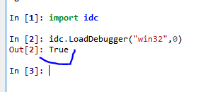

Кажется, что плагину понравился наш выбор. Он вернул нам **TRUE**.

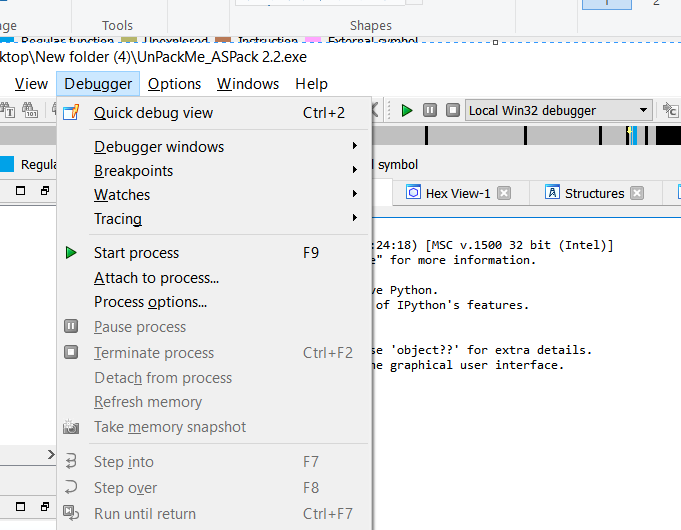

Через меню видно, что отладчик уже выбран. Если я буду повторять ту же команду, плагин вернет мне **FALSE**, потому что дебаггер уже запущен.

Метод **PUSHAD** основывается на выполнении инструкции **PUSHAD**. В следующей инструкции, видим регистры, которые сохранились в стек и устанавливаем там **BP**, чтобы остановить выполнение, когда программа попытается восстановить их с помощью инструкции **POPAD**, непосредственно перед переходом в **OEP**, после распаковки первоначального кода.

Другими словами, я устанавливаю **BP** с помощью **F2** после инструкции **PUSHAD**. Дебаггер должен остановиться после выполнения этой инструкции. \(Инструкция **PUSHA** похожа на инструкцию **PUSHAD**\).

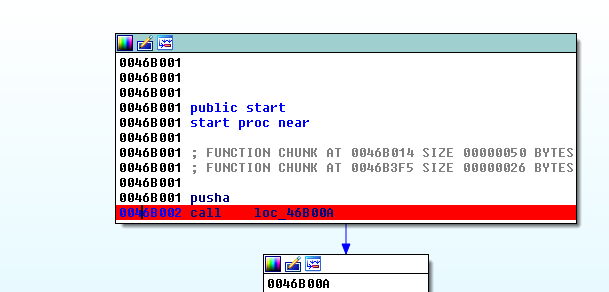

Если вы хотите установить **BP** с помощью **PYTHON**, Вы можете ввести следующую команду:

```
idaapi.add_bpt(0x46B002, 0, idc.BPT_SOFT)
```

С помощью этой команды, Вы установите **BP** прям из **PYTHON**. Первый аргумент - это адрес **BP**, второй - размер и третий аргумент - его тип. Т.е обычный программный **BP** устанавливается командой **BPT\_SOFT** или **0**.

Мы уже выбрали **ОТЛАДЧИК** и установили первый **BP**. Сейчас нам нужно запустить отладчик, для того, чтобы остановиться на этом **BP**. Это очень просто. Это можно сделать с помощью **F9** или из самого **PYTHON**, командой:

```
idc.StartDebugger("","","");
```

С помощью этой команды выбранный отладчик будет запущен. Если всё сделано правильно, то отладчик остановится на **BP**, который мы установили по адресу **0x46B002**.

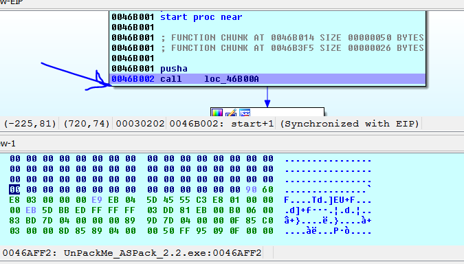

Здесь мы должны увидеть стек и установить **BP** на первой строке, чтобы остановиться на ней, потому что это место, где сохраняются значения регистров, сохраненные инструкцией **PUSHAD**, и они восстанавливаются позже с помощью инструкции **POPAD**.

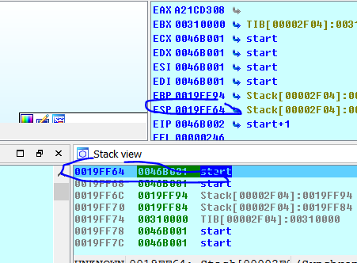

Как видно из рисунка, мы должны установить **BP** по адресу **0x19FF64** в моём случае, а в Вашем случае - это будет первый адрес стека, на который указывает регистр **ESP**.

Теперь, я помещаю курсор в окно дизассемблированного списка и нажимаю стрелку, которая находится рядом с регистром **ESP**.


Нажав стрелку рядом с регистром, отладчик будет пытаться показать этот адрес, если он существует, в окне где находится курсор. Таким образом, мы можем установить **BP** вручную с помощью **F2**, но мы должны настроить этот **BP**, так как в нашем случае, он должен сработать при **ЧТЕНИИ** и **ЗАПИСИ**, а не при **ИСПОЛНЕНИИ**, так как здесь он будет останавливаться, когда восстановит или прочитает значение. Он не выполнит здесь код.

После нажатия **F2** открывается окно конфигурации **BP**.

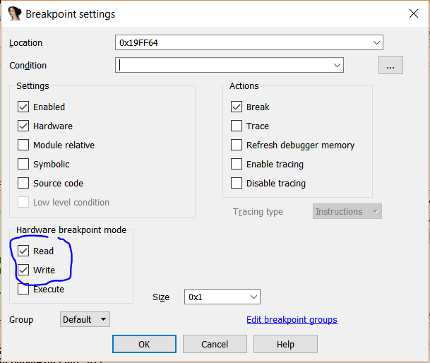

Если окно не появляется, то переходим в меню **DEBUGGER → BREAKPOINTS → BREAKPOINT LIST**


И я делаю правый щелчок и выбираю пункт **EDIT**, чтобы изменить конфигурацию, на ту, которую нам нужна.

Можем ли мы установить этот **BP** с помощью **PYTHON**?. Да, для этого существует такая команда:


**idaapi.add\_bpt\(0x019FF64, 1, 3\)**

Аргумент **1** - это длина **BP** и **3** - это тип **BP**, в этом случае это соответствует типу **READ**-**WRITE ACCESS** как видно из таблицы. Если я напечатаю эту команду, появится такой же **BP**, который мы установили, недавно, вручную.

Мы отключаем предыдущие **BP**, установленные вручную в списке **BP**, с помощью правого щелчка и выбора пункта **DISABLE**. А из **PYTHON**, это можно сделать так:

**EnableBpt\(0x46B002, 0\)**

Когда второй аргумент равен **1**, Вы включаете **BP**, а с помощью **0** - выключаете.


Как видно из картинки, здесь он зеленый, т.е. остановка на нём не будет выполняться (другими словами выключен), а тот **BP**, который красный, принадлежит стеку.


Сейчас, мы должны продолжить с помощью **F9** или напечатать в **PYTHON** команду:
**idaapi.continue\_process\(\)**


Отладчик остановится сразу после инструкции **POPAD**, когда он восстанавливает регистры и видим, что из **СТАБА** он собирается перейти в **OEP** по адресу **0x4271B0**, так как последовательность инструкций **PUSH XXX** – **RET**, это то же, что и инструкция **JMP XXX**. Так что, давайте потраcсируем, немного, до прибытия в **OEP**.

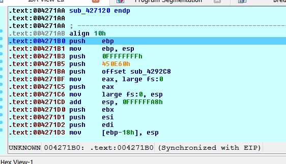

Сейчас, мы должны повторить анализ исполняемого файла, как мы делали в предыдущем случае и этим мы создадим функцию. Если бы мы просто хотели сделать снимок памяти для базы данных, чтобы изучить эту область памяти и код в ней, то для этого уже было время, не будем задерживать на этом этапе и повторять этот момент.

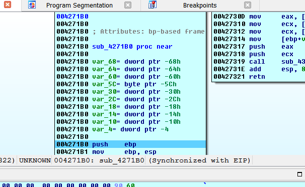

Следующий шаг, который нужно сделать - это дамп. Для этого, мы должны найти **IB** и конечный адрес в последнем сегменте исполняемого файла.

В **СЕГМЕНТАХ** мы видим, что **IB** равна **0x400000** и заканчивается по адресу **0x46E000**.


Вместо того, чтобы использовать скрипт, который мы использовали в части **15**, мы используем версию для самого **PYTHON**.

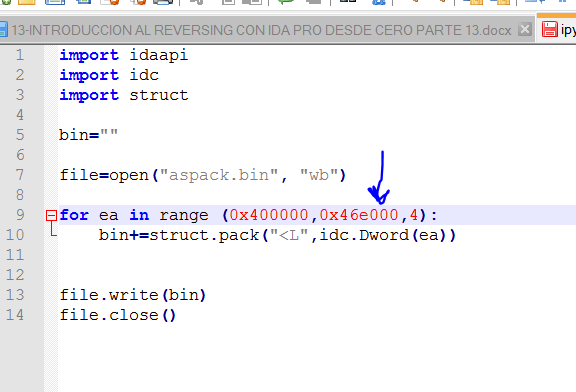

Поскольку скрипт имеет много строк, я создаю его в текстовом редакторе и сохраняю его как файл **IPYTHON\_DUMP.PY**, который также приложен к данному туториалу.

Сейчас, из меню **FILE → SCRIPT FILE**, я открываю этот скрипт. Он исполняется и создаёт файл **ASPACK.BIN**, который не имеет иконку. Для её восстановления, я буду использовать **PEEDITOR**.

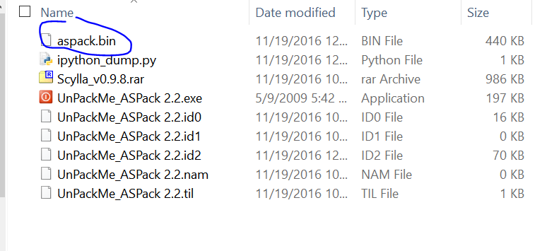

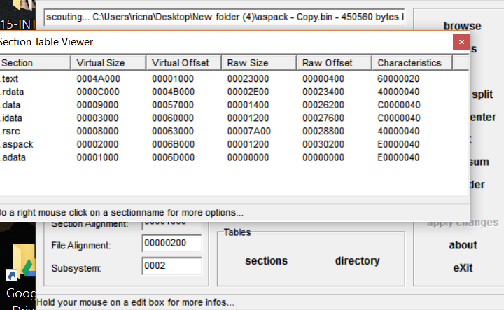

Делаем правый щелчок и выбираем пункт **DUMP FIXER**.

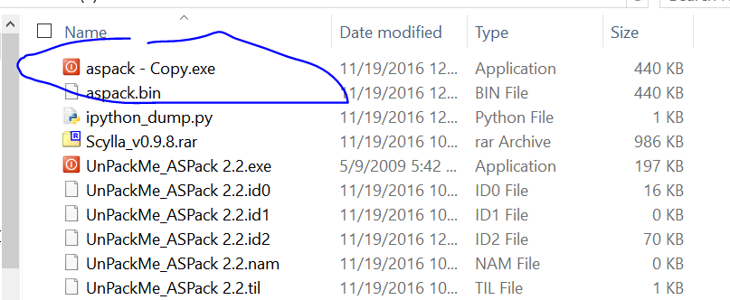

Теперь, изменив расширение файла на **EXE**, появляется иконка файла.

Сейчас, мы открываем программу **SCYLLA 0.98**. В этой части, я приложил более свежую версию. Как и раньше, будем искать процесс, который все ещё остановлен на **OEP**.

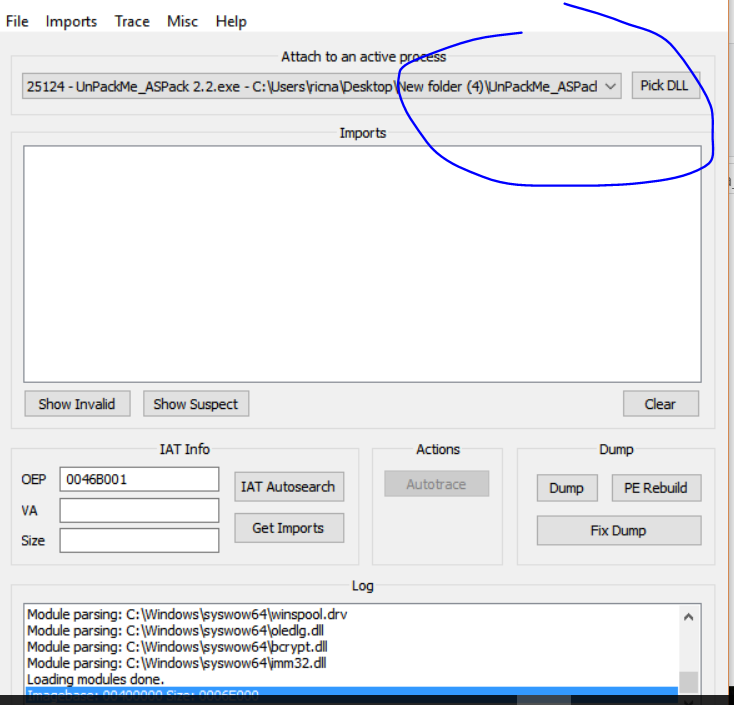

Сейчас, мы вводим **OEP**, который равен **0x004271B0** и нажимаем по очереди кнопки **IAT AUTOSEARCH** и **GET IMPORTS**.

Если нажмём кнопку **SHOW INVALIDS** и выберем режим **ADVANCED**, увидим, что существует несколько плохих записей. Давайте посмотрим, сможем ли мы починить их автоматически.

Видим, что программа не смогла их исправить сама. Так что давайте действовать вручную.

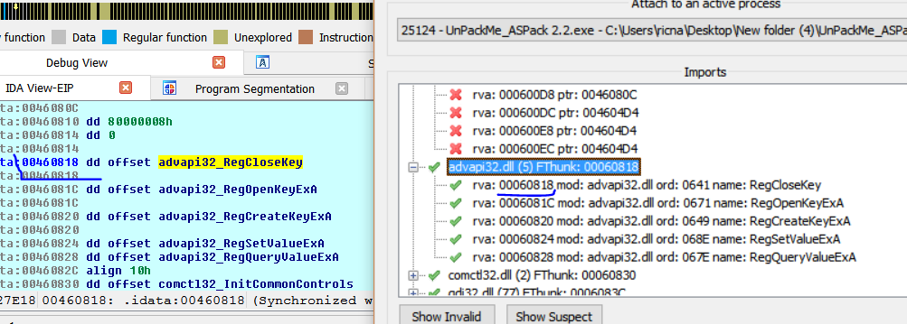

Здесь, видим первую запись по адресу **0x460818**, она правильная и совпадает с нужным вызовом.

Более того, выше начинаются недействительные записи. Давайте посмотрим, что есть в первой неверной записи, которая находится по адресу **0x4600EC**.

Если я изменяю порядок байт с помощью **D** и затем перегруппирую их, то


Видно, что содержимое не указывает ни на какой действительный адрес, а также, если я нажму **CTRL + X**, то увижу, что ссылок не существует.

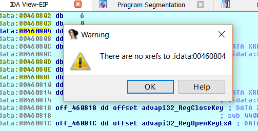

В то время, как в действительной записи, будут существовать ссылки при использовании **API**. Например так.

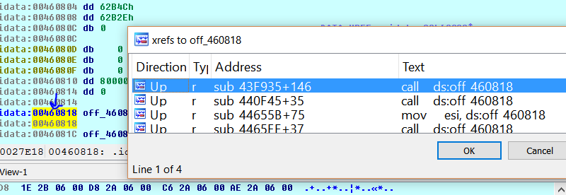

Так что - это пример недействительные записи **IAT**. Такие мы будем удалять.

Видим, что если я очищу содержимое с помощью кнопки **CLEAR** и нажму **IAT AUTOSEARCH** снова, при этом не используя расширенный режим, всё будет очень хорошо.

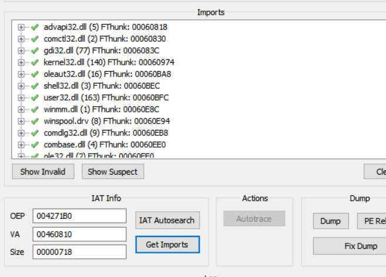

Мы видим, что **IAT** сейчас начинается по адресу **0x460810**. Видно, что нет плохих записей, которые ошибочно добавил **РЕЖИМ ADVANCED**.

Так что, сейчас, я могу выбрать наш дамп и нажать на нём **FIX DUMP**.

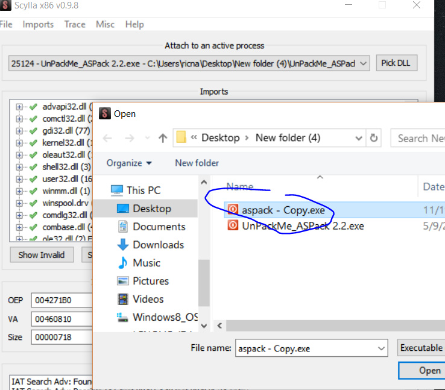

И отремонтировав сдампленный файл, я запускаю его без проблем.

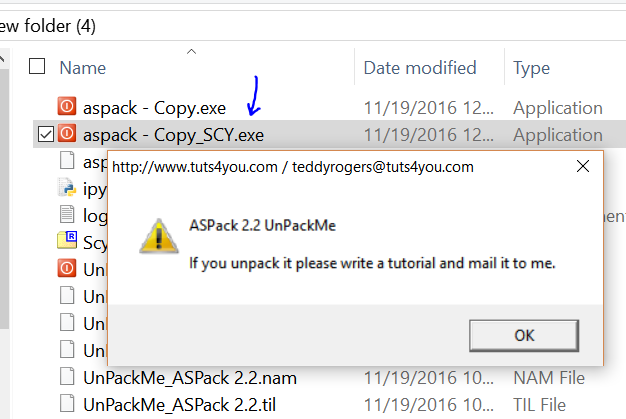

И мы написали этот туториал, потому что он сам попросил нас об этом.

До встрече в **17**-й части.

* * *

Автор оригинального текста — Рикардо Нарваха.

Перевод и адаптация на английский  язык — IvinsonCLS.

Перевод и адаптация на русский язык — Яша Яшечкин.

Перевод специально для форума системного и низкоуровневого программирования - WASM.IN

30.09.2017

Источник:

[**http://ricardonarvaja.info/WEB/INTRODUCCION%20AL%20REVERSING%20CON%20IDA%20PRO%20DESDE%20CERO/16-INTRODUCCION%20AL%20REVERSING%20CON%20IDA%20PRO%20DESDE%20CERO%20PARTE%2016%20pass%20a.7z**](http://ricardonarvaja.info/WEB/INTRODUCCION%20AL%20REVERSING%20CON%20IDA%20PRO%20DESDE%20CERO/16-INTRODUCCION%20AL%20REVERSING%20CON%20IDA%20PRO%20DESDE%20CERO%20PARTE%2016%20pass%20a.7z)
