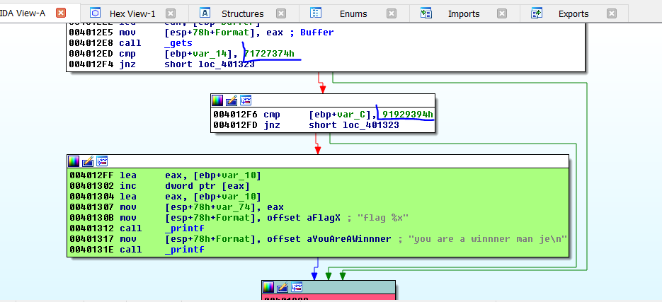
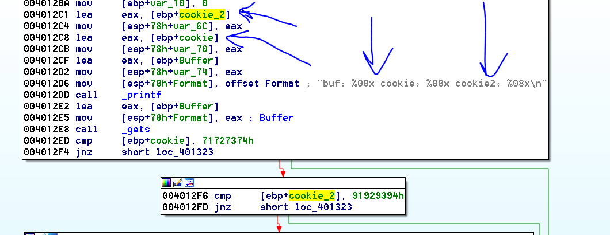
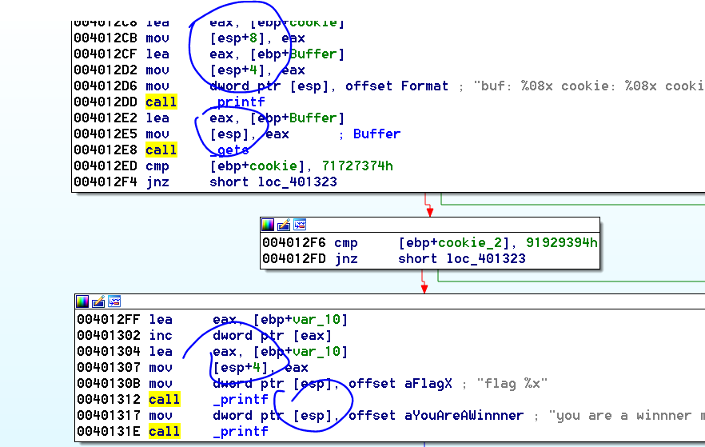
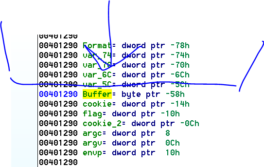
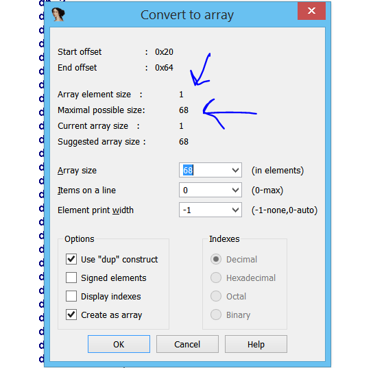
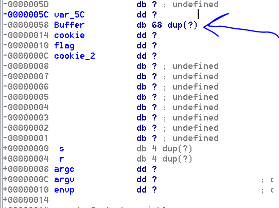
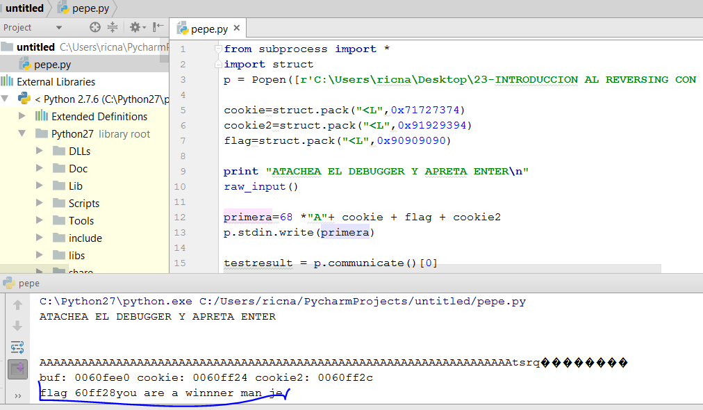

# Часть 24

Решение для упражнения **IDA2.EXE** довольно похоже на предыдущее, только здесь присутствуют две переменные или мы можем назвать их **кукисами**. Для того, чтобы перенести Вас в область хорошего сообщения, теперь сравниваются две переменные, а не одна.

Давайте посмотрим, существует ли место, где Вы можете изменить эти переменные? Мы переименовываем переменные в **COOKIE** и **COOKIE 2**, так как сама **IDA** называет их такими именами.

Мы видим, что единственные места, где есть доступ к этим переменным, находятся там, где вызывается функция **PRINTF**. Через инструкцию **LEA** программа получает адреса этих переменных, чтобы напечатать значения этих переменных, но не может сама изменить их значения.

Если мы нажмём **X** на любой из двух переменных, мы увидим, что только к одной переменной программа обращается дважды. Первый раз, чтобы получить адрес переменной, прежде чем передавать его в функцию **PRINTF** и второй раз, когда программа уже сравнивает значение переменной и константы.

Так что, если мы не можем изменить значение этих переменных, то как мы можем добраться до хорошего сообщения, чтобы прибыть к нему, если обе переменные должны иметь определенные значения?

Другая возможность заполнить эти переменные, заключается том, что в каком-то буфере есть переполнение, которое может перезаписать значение переменной.

Здесь мы видим переменную **VAR\_10**. Давайте посмотрим, что это за переменная и для чего она нужна. Видно, что она инициализируется нулём. Теперь, с помощью **X**, будем искать другие места где используется эта переменная.

Видим три места, в которых программа использует эту переменную. Первое место - когда программа инициализирует переменную в нуль.

Давайте посмотрим на две другие переменные, но прежде, согласуем аргументы, которые будут передаваться в **API**. Так что, всё это не так уродливо, используя технику, которую мы видели в моём предыдущем туториале с примером **IDA1**. Делая правый щелчок на этих переменных и изменив альтернативное представление в стеке, которое **IDA** показывает нам здесь, увидим такой код.

Сейчас код выглядит намного лучше и становится ясно как программа сохраняет аргументы в стек, чтобы передать их в **API**.

Давайте посмотрим, где программа использует эту переменную.

Здесь, с помощью инструкции **LEA**, программа получает адрес переменной и затем увеличивает её содержимое. Другими словами, увеличивается значение переменной.

Затем, программа получает снова адрес переменной и передаёт его как аргумент в функцию **PRINTF**. Другими словами, программа печатает адрес этой переменной, а не само значение. Если мы пойдём в хорошую область, то увидим.

Поскольку комментарий **IDA** говорит мне **flag %x**, мы можем переименовать переменную на то же имя. Видно, что это ни на что не влияет.

Осталось только изучить буфер, так как переменные, которые находятся выше это переменные созданные компилятором, а временные переменные, не являются переменными созданными самой программой.

Посмотрев на статическое представление стека, мы увидим:

Делая двойной щелчок на буфере, мы видим статическое представление стека в **IDA**.

Очевидно, что буфер - это место зарезервированное в памяти, для того, чтобы сохранять в него то, что напечатано в консоли, так как программа передаёт адрес как аргумент в функцию **GETS**.

Первая инструкция **LEA** получает адрес буфера и он передается функции **PRINTF**, чтобы она вывела буфер на экран и вторая инструкция **LEA** передает адрес буфера в функцию **GETS**, для того, чтобы буфер получил то, что мы напечатаем.

Чтобы увидеть размер этого буфера в статическом представлении стека, мы делаем правый щелчок и выбираем пункт **ARRAY**. Теперь видно размер, который **IDA** предлагает нам.

**IDA** предлагает нам размер буфера в 68 байт в десятичной системе, так как длина каждого элемента равна одному байту. Мы соглашаемся с этим.

Здесь мы видим буфер и кроме того видя это статическое представление, мы знаем, что заполняя буфер **68** символами он будет почти переполнен и так как функция **GETS** не имеет никаких ограничений, мы можем переполнить буфер и перезаписать его с помощью **4** байтов + переменную **COOKIE**, которая находится рядом. Затем с помощью других четырёх байтов я перезаписываю флаг, который является **DWORD** \(**DD**\) и с помощью других **4**-х байт я перезаписываю переменную **COOKIE 2**

С помощью этих знаний, мы могли бы уже создать скрипт. Те данные, которые мы бы послали программе, были бы такие.

**FRUTA = 68 \* "A" + COOKIE + FLAG + COOKIE2**

> **from** subprocess **import** \*
>
> **import** struct
>
> p = Popen\(\[**r'C:\Users\ricna\Desktop\23-INTRODUCCION AL REVERSING CON IDA PRO DESDE CERO PARTE 23\IDA2.exe'**, **'f'**\], stdout=PIPE, stdin=PIPE, stderr=STDOUT\)
>
> cookie=struct.pack\(**"&lt;L"**,0x71727374\)
>
> cookie2=struct.pack\(**"&lt;L"**,0x91929394\)
>
> flag=struct.pack\(**"&lt;L"**,0x90909090\)
>
> **print "ATACHEA EL DEBUGGER Y APRETA ENTER\n"**
>
> raw\_input\(\)
>
> primera=68 \***"A"**+ cookie + flag + cookie2
>
> p.stdin.write\(primera\)
>
> testresult = p.communicate\(\)\[0\]
>
> **print** primera
>
> **print**\(testresult\)

Вот наш цыпленок и готов. Мы устанавливаем в **кукисы** соответствующие значения, а в флаг значение **0x90909090** или любое другое, которое не влияет на исполнение.

И получаем нужный нам результат.

До встрече в следующей части. Для практики, Вы можете разобрать сами примеры **IDA3.EXE** и **IDA4.EXE**, которые прикреплены к данному туториалу.

* * *

Автор оригинального текста — Рикардо Нарваха.

Перевод и адаптация на английский  язык — IvinsonCLS.

Перевод и адаптация на русский язык — Яша Яшечкин.

Перевод специально для форума системного и низкоуровневого программирования - WASM.IN

02.12.2017

Источник:

[**http://ricardonarvaja.info/WEB/INTRODUCCION%20AL%20REVERSING%20CON%20IDA%20PRO%20DESDE%20CERO/24-INTRODUCCION%20AL%20REVERSING%20CON%20IDA%20PRO%20DESDE%20CERO%20PARTE%2024.7z**](http://ricardonarvaja.info/WEB/INTRODUCCION%20AL%20REVERSING%20CON%20IDA%20PRO%20DESDE%20CERO/24-INTRODUCCION%20AL%20REVERSING%20CON%20IDA%20PRO%20DESDE%20CERO%20PARTE%2024.7z)
