# Часть 33

Мы установим пару плагинов для **WINDBG**, которые будут помогать нам дальше при работе.

К сожалению эти плагины работают только в **WINDBG**, но если Вы запустите их в **WINDBG**, запущенном в **IDA**, они дадут сбой, возможно, потому что они конфликтуют с **PYTHON**, который включён в **IDA**, но мы будем использовать их в отдельном **WINDBG**, когда они нам понадобятся.

Мы будем копировать файлы, которые я приложил, в каталог **WINEXT**, который находится внутри каталога, где установлен **WINDBG** и установим библиотеку времени исполнения **VCREDIST\_X86**.**EXE**.

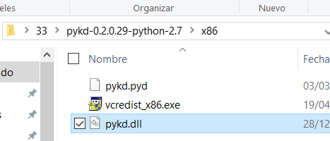

Затем, я должен сконфигурировать переменные окружения моей системы.

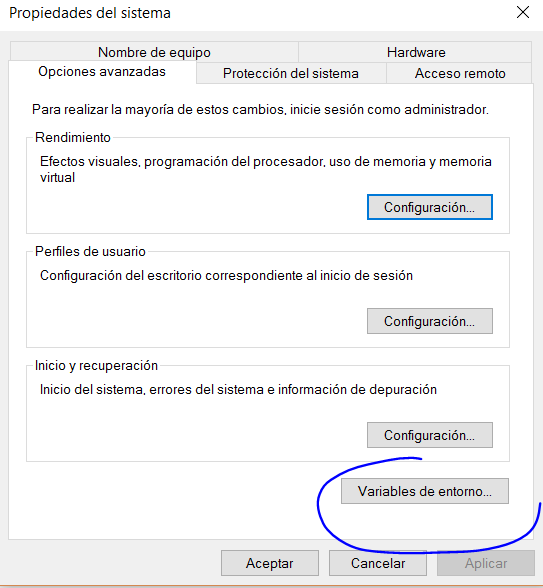

Добавьте переменную **PYTHONPATH**, к которой я добавил каталог **PYTHON**. Затем, идёт точка с запятой, и затем папка **WINEXT**. В моём случае это выглядит так.

**C:\PYTHON27;**
**C:\PROGRAM FILES \(X86\)\WINDOWS KITS\10\DEBUGGERS\X86\WINEXT**

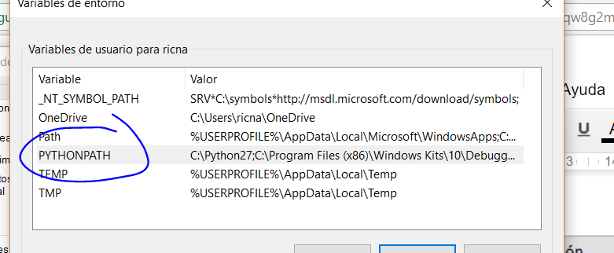

И в переменную **PATH**, которая уже существует, я добавляю в конце точку с запятой, а затем строку **C:\PYTHON27\**

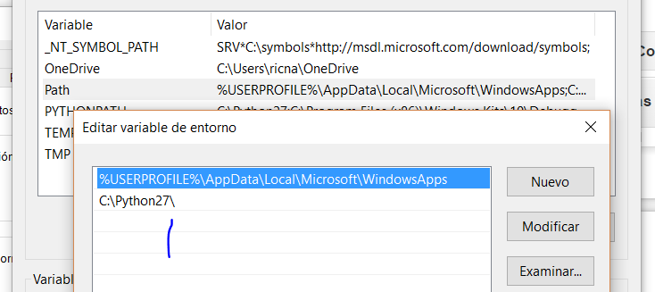

Я убеждаюсь, что строка добавлена в конец списка. Также я добавляю эту строку в системные переменные.

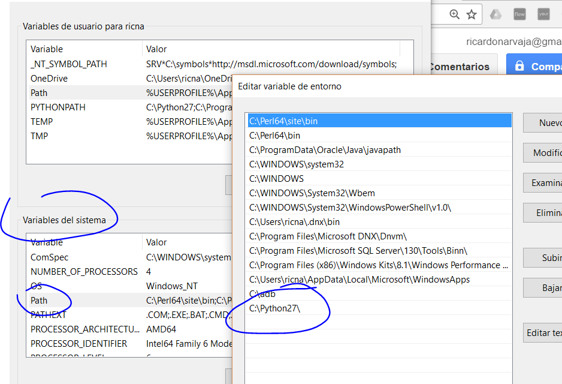

Хорошо, после перезагрузки **ПК** или принудительного завершения проводника **WINDOWS**, мы уже можем ввести в любой консоли слово **PYTHON** и система должна нам ответить его приглашением.

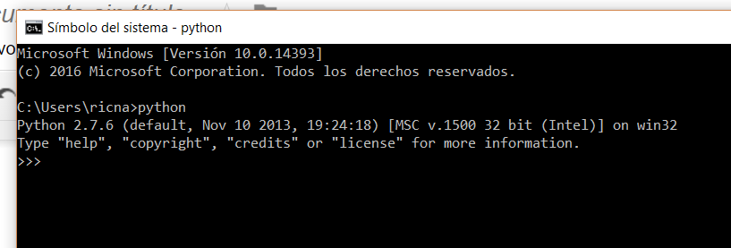

И последнее — нужно загрузить последние версии следующих файлов:

**WINDBGLIB.PY** [https://github.com/corelan/windbglib/raw/master/windbglib.py](https://github.com/corelan/windbglib/raw/master/windbglib.py)

**MONA.PY** [https://github.com/corelan/mona/raw/master/mona.py](https://github.com/corelan/mona/raw/master/mona.py)

и скопировать их в тот же каталог, где находится файл **WINDBG.EXE**

С этими настройками, скрипты уже должны работать. Давайте попробует запустить **WINDBG**, без **IDA**. Если он не запустится, то Вам нужна другая библиотека времени исполнения. Если нет, отладчик должен работать нормально.

С помощью **CTRL** + **E** мы открываем любой исполняемый файл.

Когда файл загрузится, мы вводим.

**!LOAD** **PYKD.PYD**

Ничего не случится, но и не должно появится ошибок.

С помощью команды **!PY**, я могу исполнять скрипты.

Здесь я могу также запускать команды **PYTHON**.

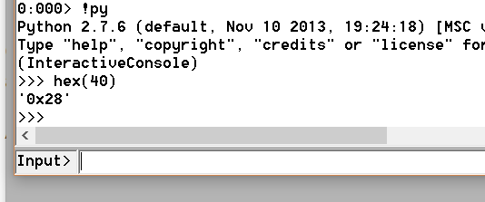

Сейчас я попробую запустить **MONA**. Я выхожу из консоли с помощью функции **EXIT\(\)** и ввожу

**!LOAD** **PYKD.PYD

!PY** **MONA**

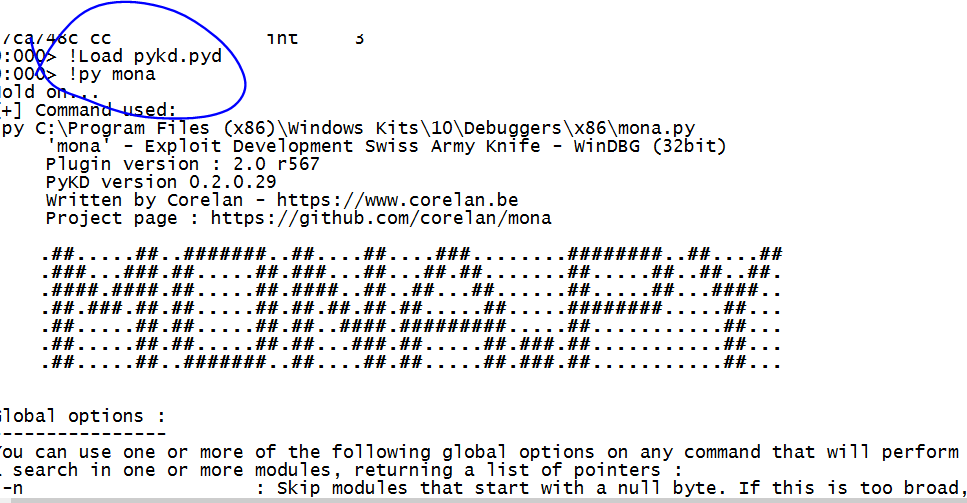

Давайте попробуем некоторые команды **MONA**:

**!PY** **MONA** **MODULES**

Мы видим защищенные модули, которые запущены. Мы будем изучать их позже. Сейчас мы подготовили рабочее окружение и готовы начать капать глубже.

**!PY** **MONA** **ROP**

Это займёт немного времени. Попробуйте увидеть, есть ли здесь такой модуль, где можно создать **ROP** \(позже мы увидим, что это такое\) и попытаемся его создать.

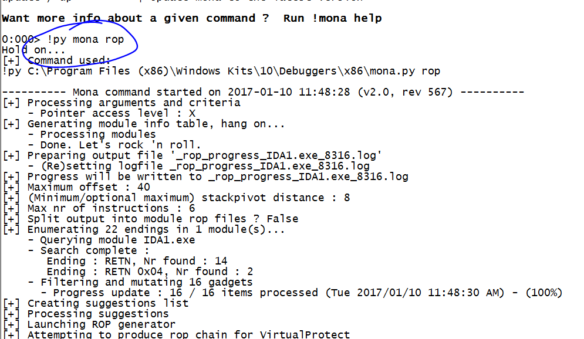

Иногда Вы можете создать **ROP**, а иногда и нет, но по крайней мере, мы увидим, что команда работает.

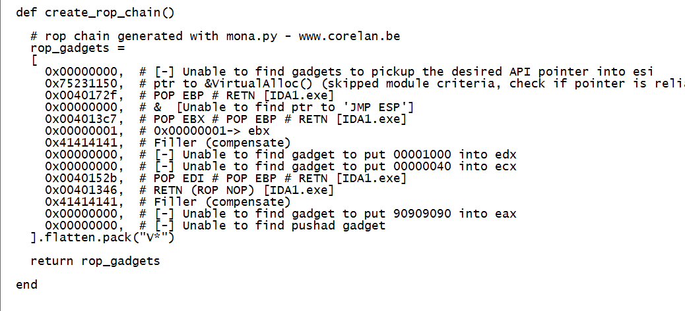

Мы видим, что **MONA** подготовила **ROP**, но поскольку я не запускал **WINDBG** от имени администратора, она не смогла записать файл с результатом, но она всё равно его напечатала.

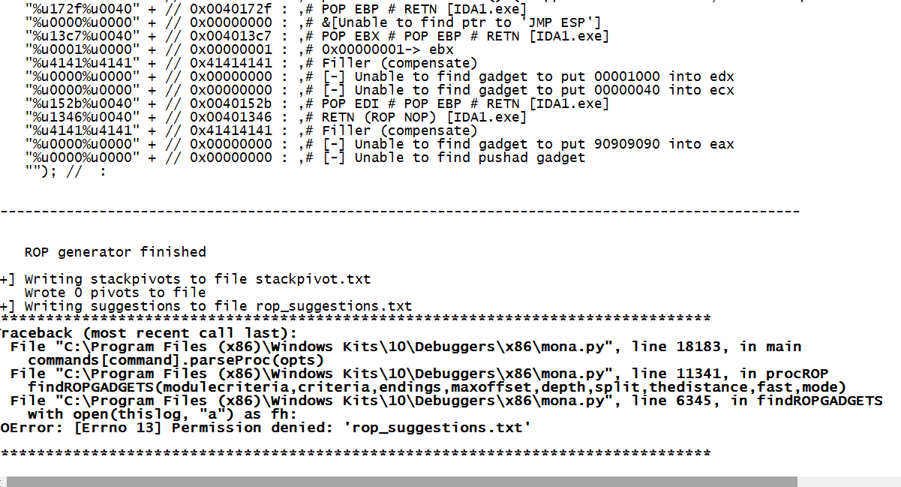

Мы можем проверить, если ли у **MONA** обновление в сети.

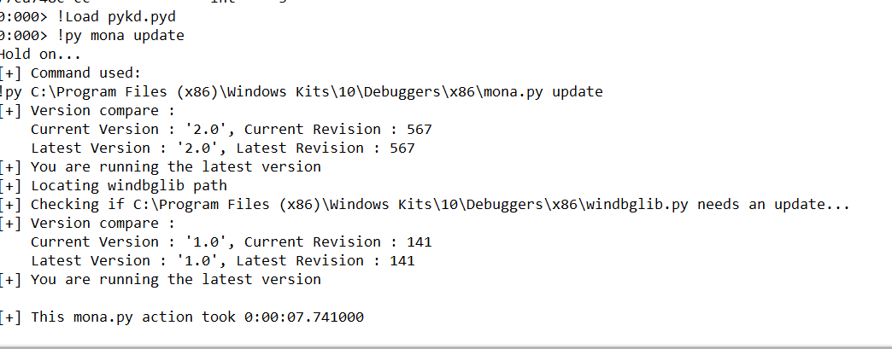

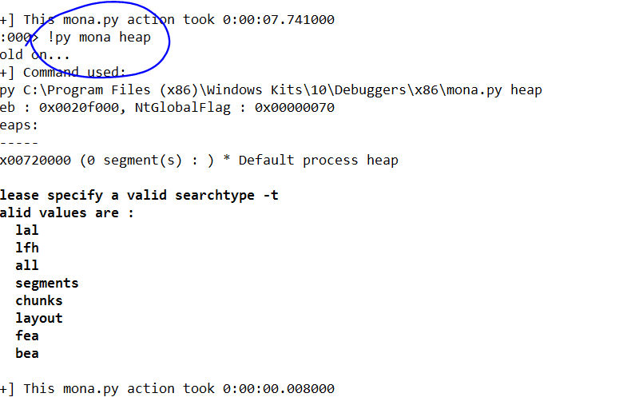

Сейчас я присоединяюсь к запущенному процессу. В моём случае, это приложение **NOTEPAD++**

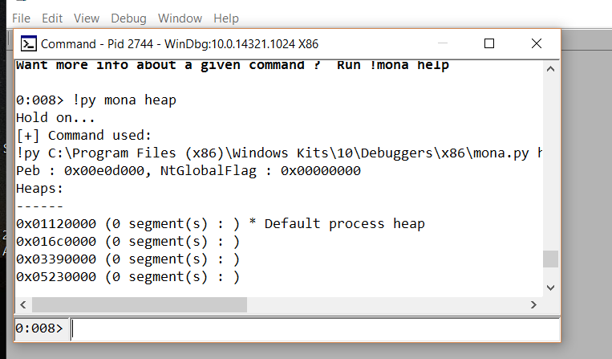

Теперь я могу видеть состояние кучи.

Скоро мы рассмотрим это всё подробнее. В любом случае, **WINDBG** также имеет команды для работы с кучей без использования **MONA**, которые мы можем использовать внутри **IDA**.

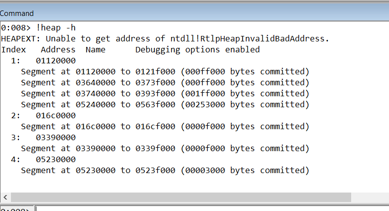

Так что тут всё хорошо. В любом случае, если нам нужно, у нас есть несколько опцией, внутри, и вне **IDA,** и теперь у нас есть всё для продвижения вперед.

Попробуем ещё команды, для развлечения \(**MONA** имеет их тысячи\)

**!PY MONA ASSEMBLE -S "JMP** **ESP"**

**!PY** **MONA GETIAT**

Она действительно имеет много полезных команд, чтобы увидеть импортированные функции.

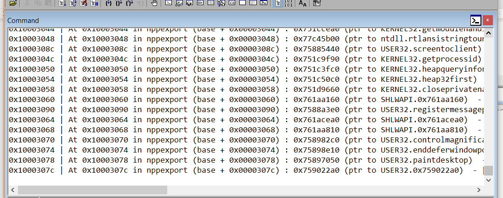

Удобно запускать **MONA** из-под пользователя **АДМИНИСТРАТОР**, чтобы сохранять информацию в файл. Мы можем получить также информацию об адресе, например так.

**!PY** **MONA INFO -A АДРЕС**

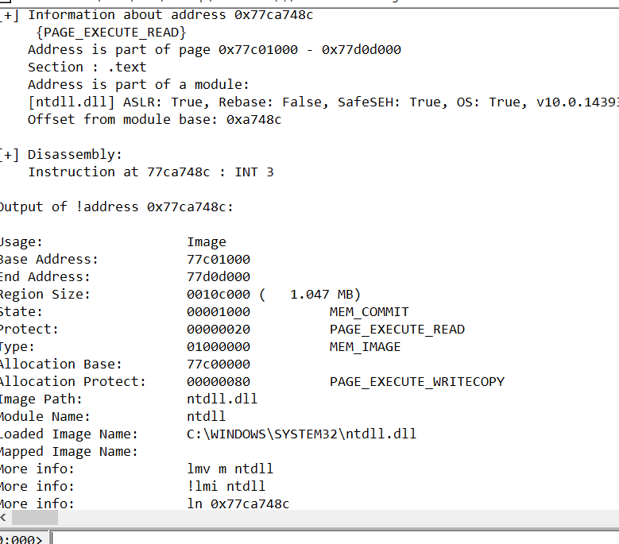

Хорошо. Мы немного отдохнули, и установили все необходимые инструменты для того, чтобы продолжать. Увидимся в **34** части.

====================================================================
Автор текста: **Рикардо Нарваха** - **Ricardo** **Narvaja** \(**@ricnar456**\)
Перевод на английский: **IvinsonCLS \(@IvinsonCLS\)**
Перевод на русский с испанского+английского: **Яша\_Добрый\_Хакер\(Ростовский фанат Нарвахи\).**
Перевод специально для форума системного и низкоуровневого программирования — **WASM.IN
27.02.2018
Версия 1.0**
