# Часть 49

На протяжении этого курса мы видели основы использования **IDA** для выполнения статического реверсинга, распаковки, эксплоитинга. У нас остаются ещё несколько тем для обсуждения, но внутри темы об эксплуатации у нас остается одна из наиболее тяжелых форм эксплуатации и которая пугает большое количество людей. Мы рассмотрим атаку **USE** **AFTER** **FREE**.

Мы в довольно полной форме в нескольких упражнениях рассмотрели тему переполнений буфера, как эксплуатировать и переполнять буферы в стеке и куче и рассмотрели видеоролики, которые мы загрузили на ютуб.

Для того, чтобы попытаться понять атаку **USE** **AFTER** **FREE**, мы будем использовать упражнение **EXAMEN** **20** в качестве примера поскольку его действительно можно эксплуатировать только как **USEAFTER** **FREE.** В коде нет переполнения и все буферы всегда остаются правильными. Если это так, то как мы можем эксплуатировать уязвимость и отклонить выполнение программы?

Чтобы понять это, Вам нужно сначала загрузить исходный код **EXAMEN** **20**.

[https://drive.google.com/file/d/0B13TW0I0f8O2WDRfQTlvT1JoNnc/view?usp=sharing](https://drive.google.com/file/d/0B13TW0I0f8O2WDRfQTlvT1JoNnc/view?usp=sharing)

Исполняемый файл, который зазипован и имеет пароль **a** находится здесь:

[https://drive.google.com/file/d/0B13TW0I0f8O2N1gtZWNianZpNnM/view?usp=sharing](https://drive.google.com/file/d/0B13TW0I0f8O2N1gtZWNianZpNnM/view?usp=sharing)

И символы

[https://drive.google.com/file/d/0B13TW0I0f8O2c3RRUUpJTFJMaEE/view?usp=sharing](https://drive.google.com/file/d/0B13TW0I0f8O2c3RRUUpJTFJMaEE/view?usp=sharing)

Символы должны быть переименованы и иметь те же имена как у исполняемого файла, но только с расширением **PDB**

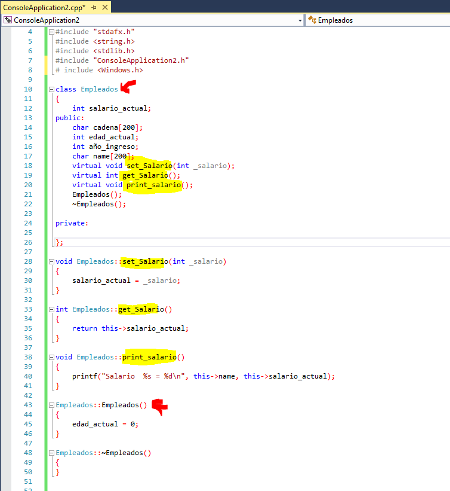 ****

В исходном коде, класс называется **EMPLEADOS.** Его конструктор называется **EMPLEADOS**::**EMPLEADOS** и виртуальные методы, которые говорят **MAL** и **PRONTO**, будут функциями, которые будут использоваться экземплярами этого класса.

Пока здесь всё понятно. Давайте посмотрим экземпляры в функции **MAIN**.

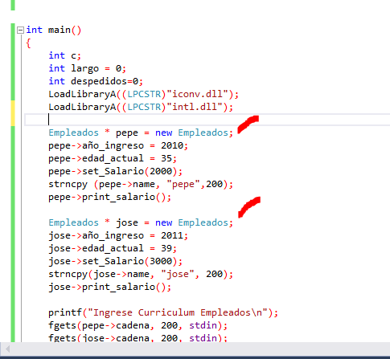

Мы видим два экземпляра с именами **PEPE** и другой **JOSE** того же класса **EMPLEADOS.** То же самое, в этом случае, выполняется используя функцию **NEW\(\)**, которая очень похожа на **MALLOC**, но более ориентированна на создание, в этом случае, этих экземпляров, резервируя необходимую память в кучи. \(Мы помним, что когда мы трассировали функцию **NEW\(\)** мы приходили в функцию **MALLOC**\).

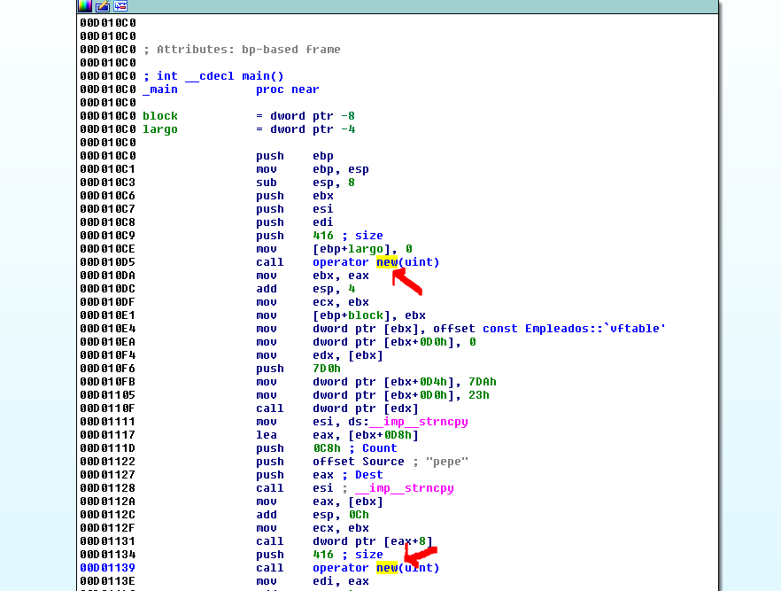

В исполняемом файле есть два вызова **NEW\(\)** для создания обоих экземпляров **PEPE** и **JOSE**.

И если мы заглянем во внутрь вызова **NEW,** мы увидим, что вызывается функция **MALLOC** с размером, который идёт в качестве аргумента. В этом случае **416** десятичных байт или **0x1A0,** является размером, который необходим каждому экземпляру.

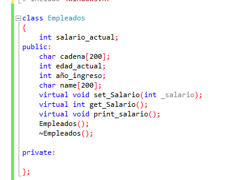

Мы знаем, что на низком уровне экземпляр подобен переменной структурного типа и должен иметь место для хранения всех атрибутов класса, которые эквивалентны полям структуры. Мы видим тип **INT** для **SALARIO**\_**ACTUAL**, и в публичной части буфер из **200** десятичных байт называемый **CADENA.** Другой буфер называется **NAME** и мы видим, также, объявление виртуальных методов.

Обычно внутри конструктора, на первом месте пространства зарезервированного для каждого экземпляра сохраняется указатель на таблицу адресов виртуальных методов под названием **VTABLE\(ВИРТУАЛЬНАЯ ТАБЛИЦА\)** и в каждом экземпляре будет указатель на ту же таблицу или **VTABLE**.

В предыдущем упражнении **№** **19**, которое также было с классами, хотя там не было оператора **NEW** потому что экземпляр был переменной в стеке, а не в куче, конструктор был хорошо виден.

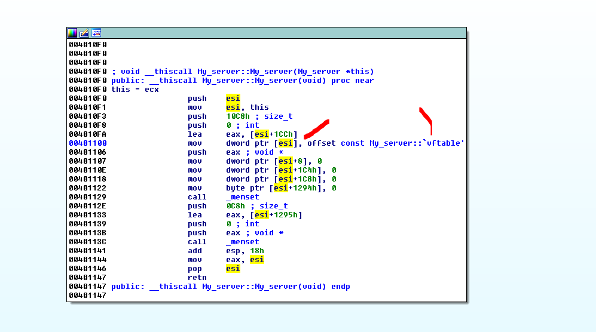

И поскольку внутри него же в первом **DWORD** сохраняется указатель на **VTABLE**.

Который указывает на виртуальные методы. Сейчас в этом примере конструктор в **IDA** не рассматривается, если он существует, поскольку мы имеем символы, который программа должна вызывать, называется **EMPLEADOS::EMPLEADOS,** а этот метод не существует.

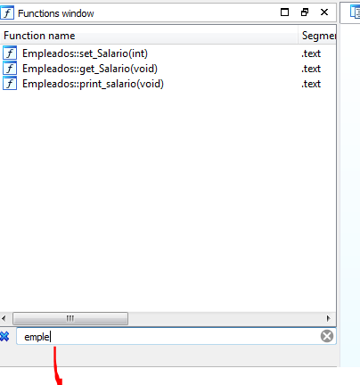

Хорошо. Что происходит, так это то, что компилятор, как я вижу, говорит, что конструктор очень маленький и почти ничего не делает при оптимизации. Я исключаю этот метод и заменяю его инструкциями, которые содержат:

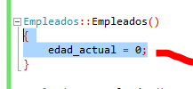

Конструктор только устанавливает этот атрибут в нуль и также должен установить **VTABLE** сразу после оператора **NEW,** который создаёт экземпляр. Давайте посмотрим на это в **IDA**.

Здесь конструктор делает две вещи - устанавливает в нуль этот атрибут и устанавливает **VTABLE** для её последующего использования.

Таким образом, конструктор сохраняет в первое место зарезервированной память каждого экземпляра, указатель на эту таблицу или **VTABLE**.

Прежде чем реверсить полностью пример, что мы увидим в соответствующем видео, давайте посмотрим как выглядит механизм уязвимости **USE** **AFTER** **FREE** и как он эксплуатируется.

Внутри программы, в соответствии с определенными условиями, объект удаляется с помощью оператора **DELETE\(\)**, что эквивалентно функции **FREE\(\)**, экземпляра **PEPE** или **JOSE**.

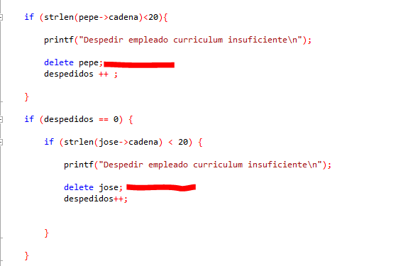

После прекращения существования любого из этого экземпляра кому-то в голове придет просить заработную плату всех сотрудников, чтобы составить полные затраты и для этого он использует виртуальный метод get\_Salario примененный к каждому экземпляру.

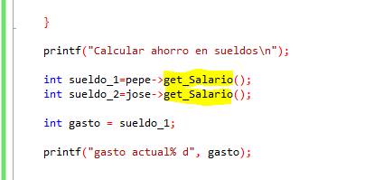

Предположим, что **PEPE** это экземпляр, который удаляется. Когда вы пытаетесь вызвать функцию **GET\_SALARIO**, программа будет искать в своем блоке, который был освобожден \(**FREE**\) и попытается использовать указатель на **VTABLE**, который был там внутри и попытается перейти к методу **GET\_SALARIO**, но поскольку блок освобожден, возможно что программа продолжит выполнение, выделит её там, если она запрашивается и перезапишет указатель на **VTABLE**.

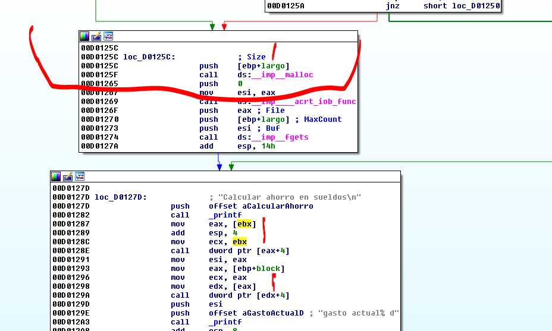

Здесь, ниже, мы видим вызовы **GET\_SALARIO.** Каждый экземпляр будет искать внутри в первую очередь его указатель на **VTABLE** и пробовать перейти на этот метод, но эксплуатация состоит в попытке увидеть какой размер удаляемого объекта, который удаляется и выделить тот же размер и заполнить с помощью наших фруктов блок, который ранее занимал экземпляр **PEPE**, и сейчас он будет заполняться нашими фруктами. Таким образом, мы переходим к функции **GET\_SALARIO** так как мы переписали его указатель на **VTABLE.** Мы будем перенаправлять выполнение куда захотим.

Мы увидим что код создается вручную, без создания скрипта.

Я запускаю пример в **IDA**. Я устанавливаю **BP** на **NEW\(\)**.

Я продолжаю использовать **WINDOWS** **7,** которая на данный момент уверяет меня, что только с **MALLOC** я могу перезаписать занятый блок**.** Мы увидим как это сделать в **WINDOWS10**.

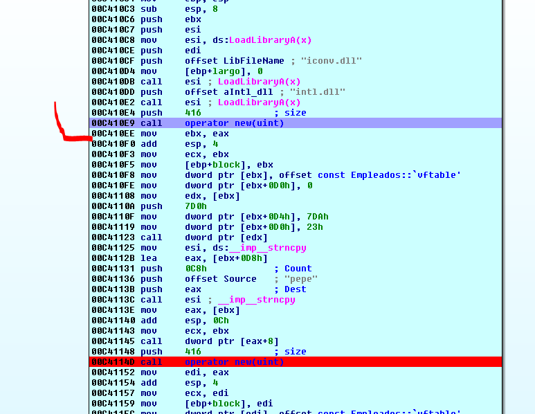

Я остановился здесь. Я ввожу **416** байт. Прохожу оператор **NEW** с помощью **F8**.

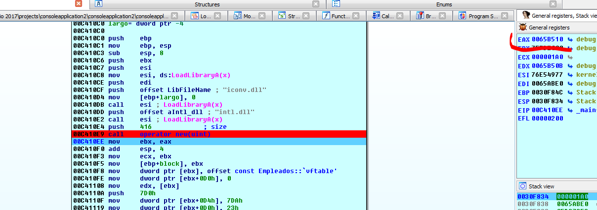

В моём случае, программа выделяет мне блок, который начинается по адресу **0x65B510**

В первом **DWORD** сохраняется указатель на **VTABLE.** Регистр **EBX** указывает туда где она будет сохраняться.

Здесь находится **VTABLE.** Но мы помним, что в выделенной памяти есть указатель на **THIS**.

Давайте пойдём в другой вызов **NEW\(\).**

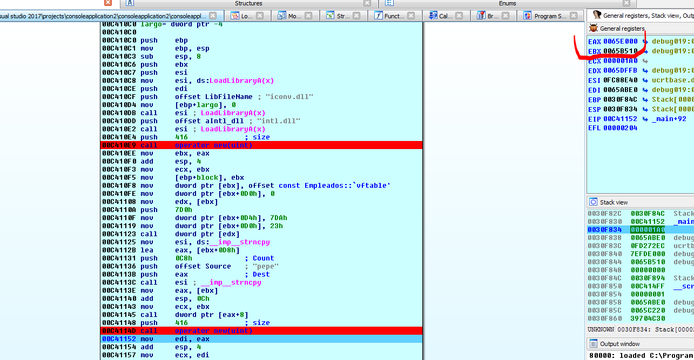

Второй экземпляр **JOSE** будет расположен, в моём случае, по адрес **0x65E000** и ниже будет сохраняться его указатель на **VTABLE**.

Конечно, этот указатель находится во втором экземпляре, но указывает на ту же самую **VTABLE**, которая была в первом.

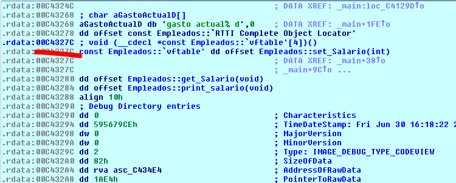

Давайте продолжать.

Затем есть часть кода, которая говорит, что мы вводим резюме сотрудников и там есть функция **FGETS**.

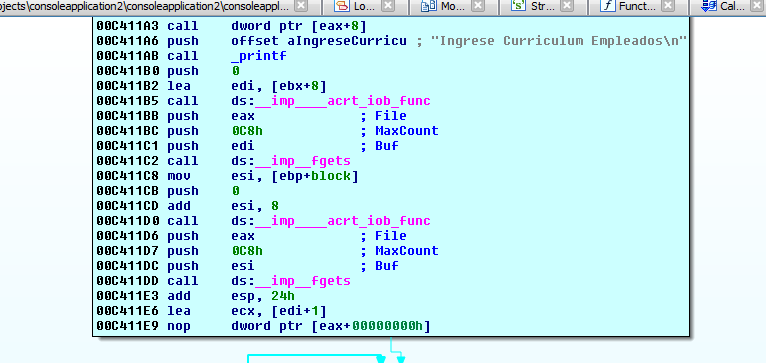

Мы можем поместить **BP** чуть ниже, на вызове **DELETE** и нажать **RUN**.

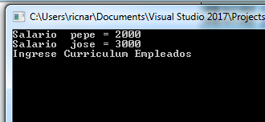

Я ввожу короткое значение.

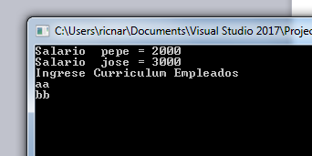

Когда я нажимаю **ENTER** программа достигает оператора **DELETE\(\)**

Аргумент оператора **DELETE** это адрес экземпляра, который нужной удалить.

Программа удалит блок из адрес **0x65B510** который был первым, т.е. **PEPE**.

Если я трассирую функцию **DELETE,** я вижу, что отладчик достиг функции **FREE** освобождая память по адресу **0x65B510**.

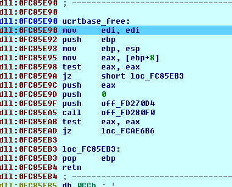

Затем программа просит меня ввести длину анкеты.

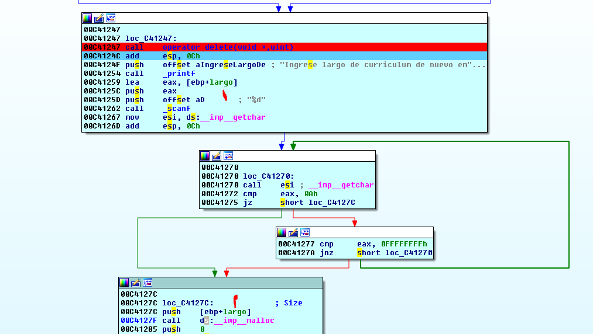

И это значение будет тем, что вы используете для выделения и туда будете копироваться значения, чтобы вызвать **USE** **AFTER** **FREE.** Программа должна передать тот же размер удаленных инструкций, т.е. **416** десятичных.

Если я установлю **BP** на функции **MALLOC** и нажму **RUN** я введу программе этот размер **416**

При нажатии **ENTER** я дохожу до вызова функции **MALLOC.**

Я вижу, что программа будет делать вызывать **MALLOC\(416\)**. Если программа вернет мне тот же адрес памяти, который я освободил то я пойду в правильном направалении, иначе ничего не получится.

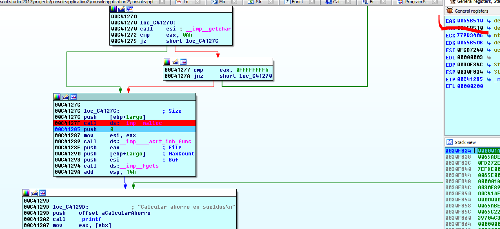

Я выделяю в том же адресе. Сейчас я должен только скопировать мои фрукты туда. Они вводятся с помощью **FGETS.** Я нажимаю **RUN,** помещаю **BP** на **PRINTF**.

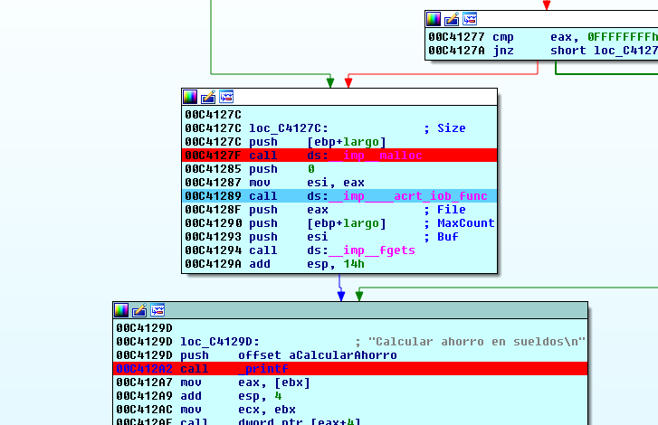

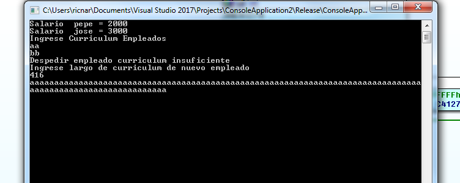

Я ввожу мои фрукты и при нажатии **ENTER**.

Программа пытается найти указатель на **VTABLE** **PEPE** по адресу **0x65B510** и здесь я заполняю буфер моими символами **A**.

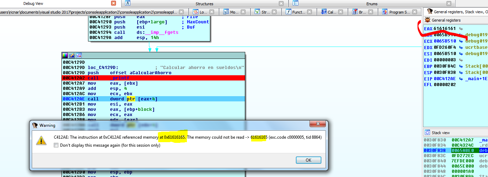

Здесь мы видим, как отклоняется выполнение кода, которое контролируется фруктами, которые мы вводим.

Это очевидно является простым примером в сложной программе. Вещь это более сложная для реализации, но идея состоит в том, что важно четко понимать, концепцию того как эксплуатируется баг.

Мы увидим, что он будет глубоко отреверсен, в соответствующем видео на ютубе.

**=======================================================
Автор текста: Рикардо Нарваха** - **Ricardo** **Narvaja** \(**@ricnar456**\)
Перевод на русский с испанского: **Яша\_Добрый\_Хакер\(Ростовский фанат Нарвахи\).**
Перевод специально для форума системного и низкоуровневого программирования — **WASM.IN
06.08.2018
Версия 1.0**
