# Часть 51

Перед тем, как приступить к **ВИДЕОТУТОРИАЛАМ**, мы должны скомпилировать и пореверсить немного те драйверы, что были сделаны в предыдущей части, а также некоторые другие драйверы, чтобы ознакомиться с тем, как они работают.

В случае простого драйвера из части **50**, это простой **HELLO** **WORLD**, очень простой для реверсинга. Мы уже увидели, что при его компиляции со старым **WDK** **7.1** есть несколько простых подпрограмм, а в новом **WDK** **10** есть несколько функций перед инициализацией, но они приходят к тому же коду. Там нет никакой другой функциональности.

Здесь мы находимся в том месте, что будет точкой входа в драйвер **DRIVERENTRY** в старом драйвере сделанном в **WDK** **7**.**1**.

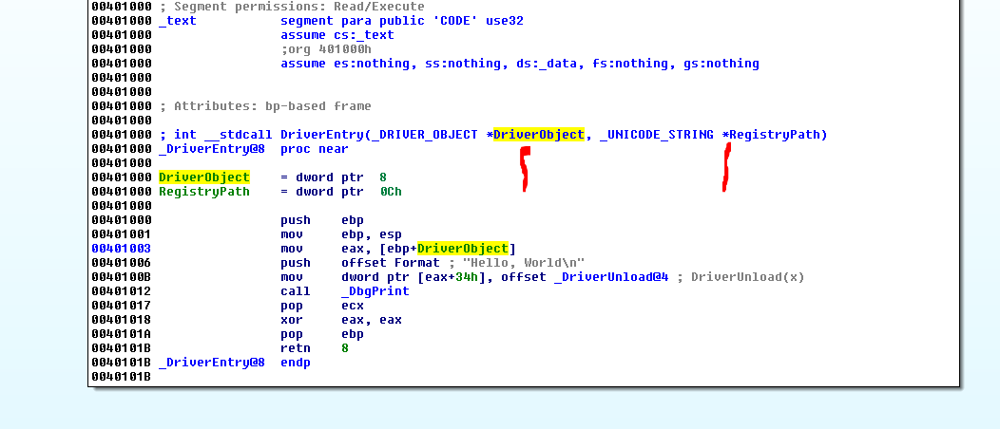

Мы видим по звездочкам, что есть два аргумента, которые являются двумя указателями, т.е. по **4** байта. Первый это указатель на структуру **\_DRIVER\_OBJECT**, а второй на структуру **\_UNICODE\_STRING**. Давайте посмотрим их, так как **IDA** обнаруживает их

В **MSDN**.

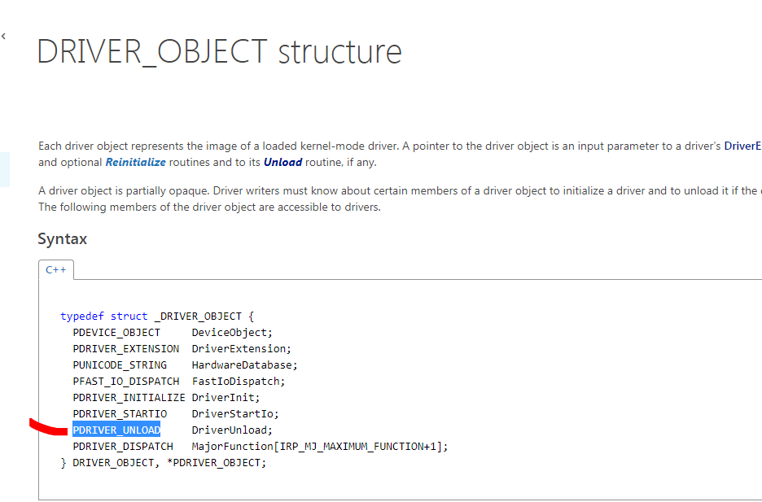

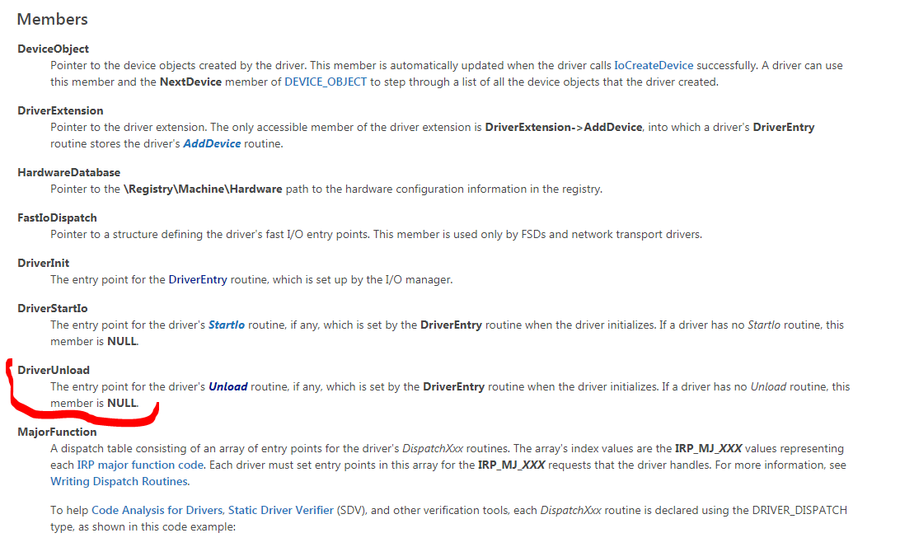

Во вкладке структуры их нет. Но не забываем, что в **LOCAL** **TYPES** иногда есть больше структур. Мы также замечаем там это.

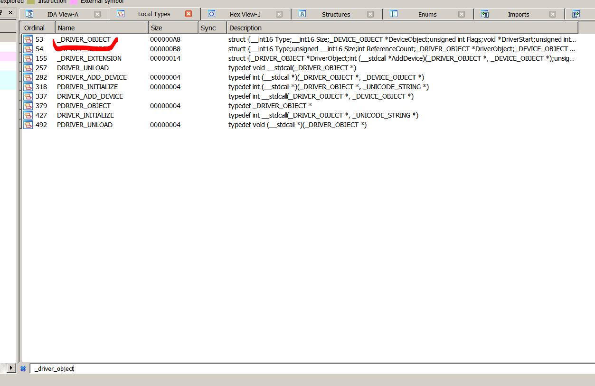

Хорошо. Вот она. Мы будем импортировать её. Делаем правый щелчок и выбираем **SYNCRONIZE** **TO** **IDB**.

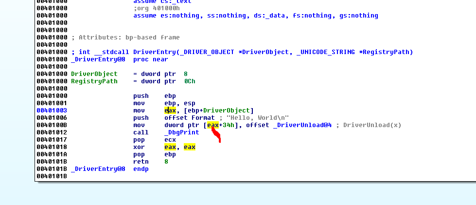

Поскольку я загружаю адрес структуры в регистр **EAX**, я знаю, что **EAX**+**34H** это какое-то поле структуры. Мы нажимаем **T,** чтобы увидеть.

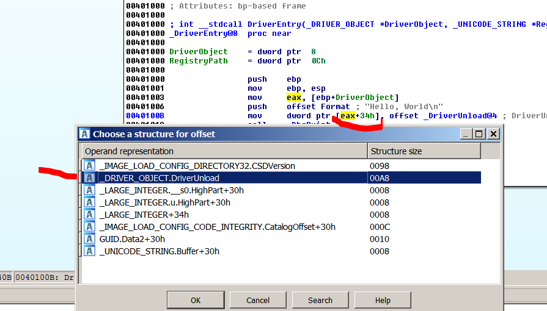

Из структур, которые загружены, я выбираю \_**DRIVER**\_**OBJECT** и это поле **DRIVERUNLOAD**.

В переводе на испанский, это переменная указатель в структуре, которая сохраняет адрес функции, которую система будет вызвать при выгрузке драйвера. Здесь вверху мы видим, что тип функции определен, её аргумент это указатель на \_**DRIVER**\_**OBJECT** и ввеху всего этого мы видим определение структуры **PDRIVER**\_**UNLOAD** что очевидно является адресом, так как это указатель на ту же фунцию. Мы видим звездочку в определении.

Поэтому это поле предназначено для хранения адреса функции, которую система вызывает, когда выгружается драйвер.

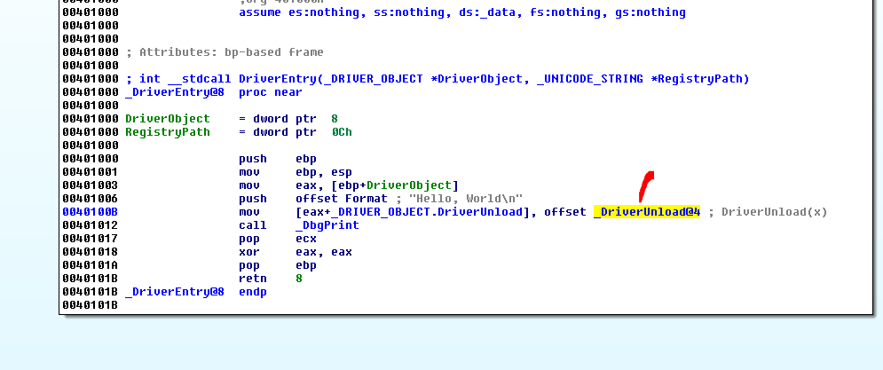

В нашем случае, **IDA** показывает нам смещение, так как это адрес функции \_**DRIVERUNLOAD.** Нажимаем пункт **DEMANGLE** **NAMES** → **NAMES.** Теперь всё выглядит лучше.

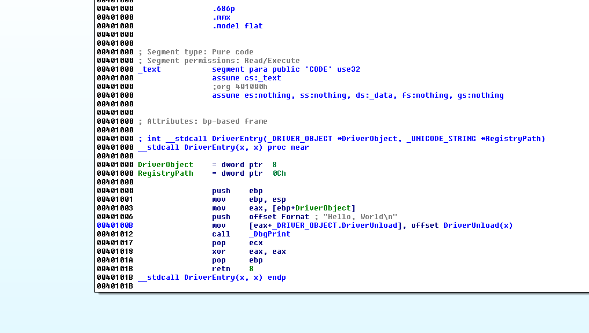

Поэтому, когда запускается драйвер, он приходит сюда и печатает “**HELLO** **WORLD**” каждый раз, когда он запускается, посредством функции \_**DBGPRINT** и сохраняет адрес функции, которая будет выполняться при выгрузке драйвера.

Давайте запомним, что функция, которую мы создали **DRIVERUNLOAD** в нашем коде, должна быть скорректирована до типа, определенного ранее, т.е. его аргумент должен быть указателем на **\_DRIVER\_OBJECT**, и поэтому наш аргумент имеет тип **PDRIVER\_OBJECT**, как говорят определения функции в исходном коде.

\#include &lt;ntddk.h&gt;
void DriverUnload\(
PDRIVER\_OBJECT pDriverObject\)
{
DbgPrint\("Driver unloading\n"\);
}

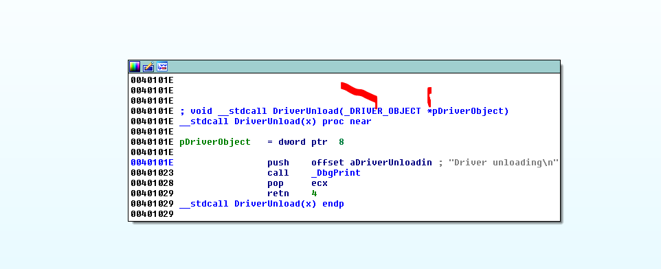

Так что все типы совпадают. Это будет процедура, когда драйвер будет выгружатся, и как мы видим, напечатает сообщение “**DRIVER** **UNLOADING**” используя функцию \_**DBGPRINT**.

Если драйвер отлаживается, сообщение будет видно в **ЛОГАХ** отладчика. Как мы видели в **WINDBG** и в **IDA** сообщение “**HOLA** **MUND** ” и “**DRIVER** **UNLOADING**” при загрузке и выгрузке.

В этой версии не так много интересного. Мы увидим другую версию, которая скомпилирована с **WDK** **10**, поэтому реверсим эту совсем чуть-чуть. Мы проходим мимо части инициализации, и сосредоточимся на том, как драйвер управляет структурой и указателем на **DRIVERUNLOAD**.

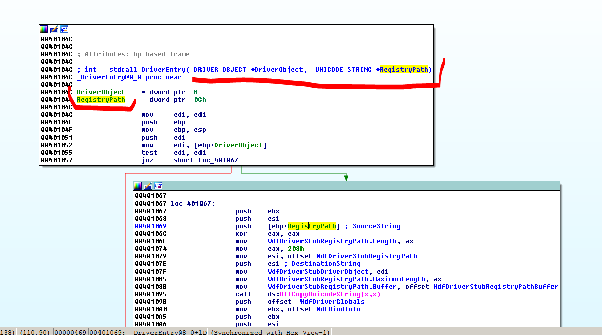

Функция \_**DRIVERENTRY**@**8** имеет те же аргументы, которые являются двумя указателями на структуры, которые мы видели в другой части.

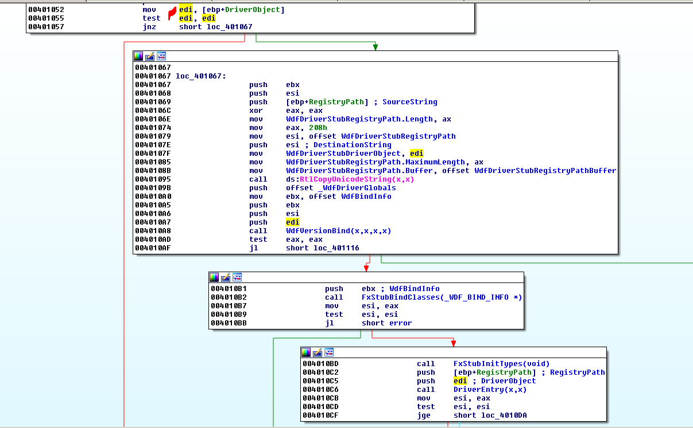

Мы видим, что регистр **EDI** берет адрес структуры **DRIVEROBJECT** и использует его во всей функции вплоть до выхода из неё, когда исполняется **POP** **EDI** перед **RET.**

Я могу сделать правый щелчок и выбрать **RENAME** в регистре **EDI** и в диапазоне, где остается то же значение. Я переименую его в **P\_DRIVEROBJECT**.

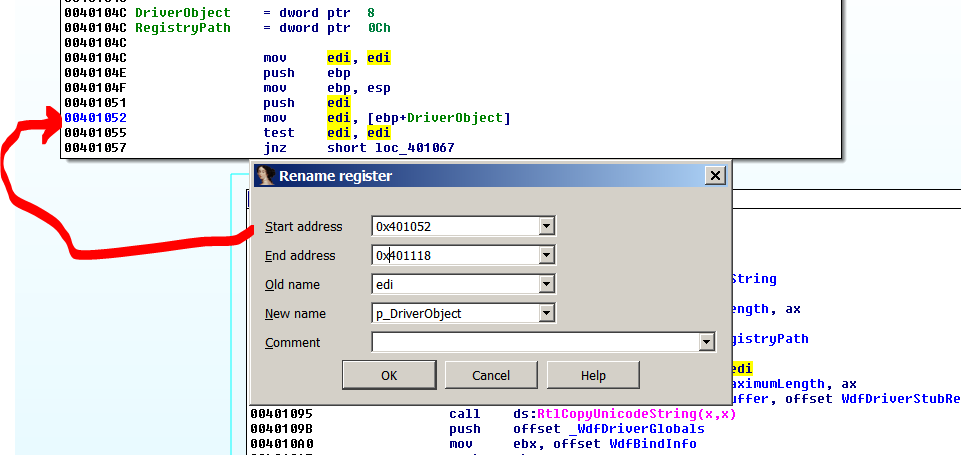

Эта метка распространяется до самого конца, где уже **POP** **EDI** изменяет значение.

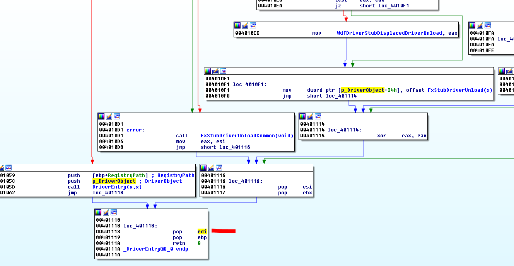

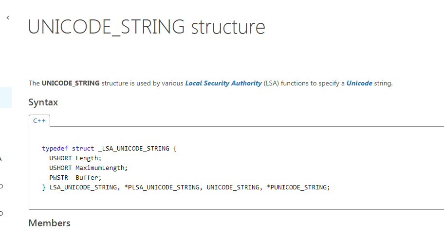

Хорошо. Это структура, которая имеет тип **USHORT** \(слово\) в переменной **LENGHT**. Другая переменная с максимальной длиной буфера и указатель на буфер со строкой типа **UNICODE.** Другими словами, всегда длина структуры будет **0x8**, два **WORD** плюс указатель типа **DWORD**.

**Length**
Specifies the length, in bytes, of the string pointed to by the **Buffer** member, not including the terminating **NULL** character

**MaximumLength**
Specifies the total size, in bytes, of memory allocated for **Buffer**. Up to **MaximumLength** bytes may be written into the buffer without trampling memory.

**Buffer**
Pointer to a wide-character string. Note that the strings returned by the various LSA functions might not be **null**-terminated.

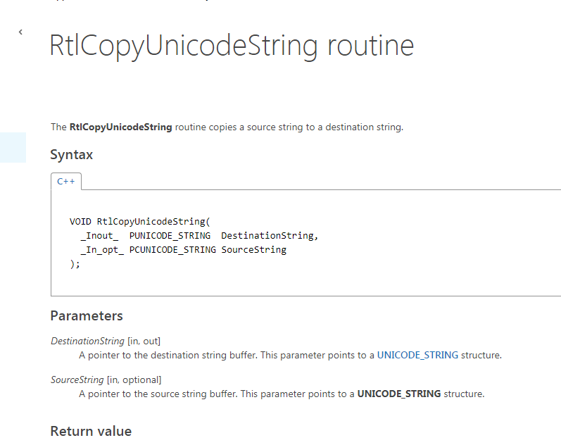

Мы видим, что эта функция имеет в качестве аргумента указатель на исходную структуру **UNICODE**\_**STRING** и как назначение, указатель типа **UNICODE**\_**STRING.**

Здесь мы видим два аргумента, источник, который является **REGISTRYPATH**, который является указателем на структуру **UNICODE**\_**STRING** и регистр **ESI**, который имеет назначение того же типа.

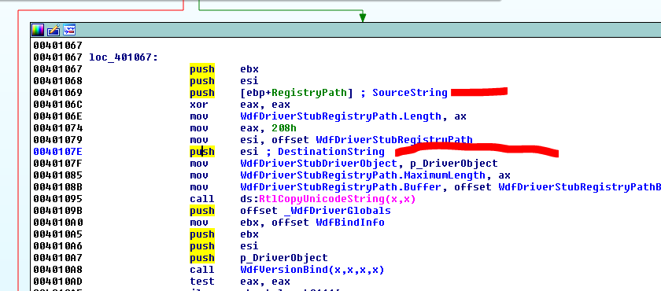

Регистр **ESI** указывает на секцию данных. Здесь есть эта переменная того же типа.

Поскольку, мы видим, что длина была **0x8** байт, в секции данных следующий адрес, который остается будет на **0x8** больше, т.е.

Python&gt;hex\(0x40367c+0x8\)
0x403684

Здесь мы видим, как перед вызовом функции для копирования, инициализируется структура назначения. Программа помещает нуль в значение длины, так как на данный момент эта переменная пуста. Программа помещает значение **0x208** в **MAXIMUMLENGHT** и сохраняет указатель на буфер в смещении **WDFDRIVERSTUBREGISTRYPATH**.

Сам буфер имеет **0x104** слова, т.е. **0x208** байта или **520** в десятичной системе

hex\(0x104\*2\)
0x208
Python&gt;\(0x104\*2\)
520

Здесь я показываю, что это массив **260** типа **WCHAR\_T** \(**2** байта\), т.е. **260** \* **2** что равно **520**.

Поэтому все нормально. Указатель указывает на буфер длиной **0x208** и максимальное значение также равно **0x208.**

Давайте не будем забывать об этом.

Это переменная из **4** байтов **DD,** так как это указатель на структуру \_**DRIVER**\_**OBJECT**.

Затем есть пара недокументированных функций инициализации. По крайней мере я их не нашел в документации, и это не так важно. Всё это чистая инициализация. А затем программа приходит к **DRIVERENTRY**, функция которого эквивалентна предыдущему драйверу.

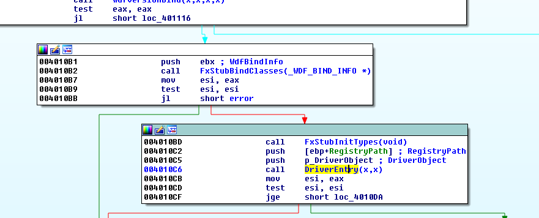

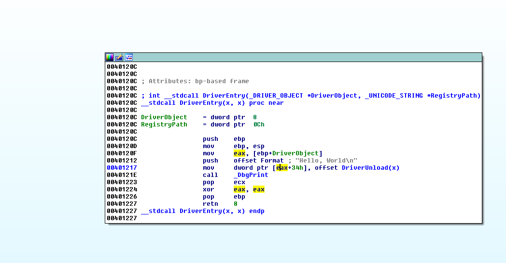

Внутри функции, если мы делаем то же самое как в предыдущий раз и пойдем в **LOCAL** **TYPES** и синхронизируем структуру **DRIVER**\_**OBJECT**.

Мы видим, что драйвер похож на предыдущий. Он сохранит адрес функции, которую мы назвали как **DRIVERUNLOAD** в том поле структуры, чтобы вызывает ее, при выгрузке.

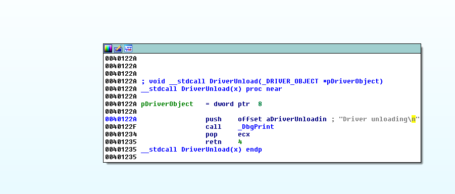

Мы видим, как поле **DRIVERUNLOAD** проверяется на нуль. Программа переходит в розовую часть, где будет сохранен указатель на нашу функцию в эту переменную секции данных под названием **WDFDRIVERSTUBDISPLACEDDRIVERUNLOAD**.

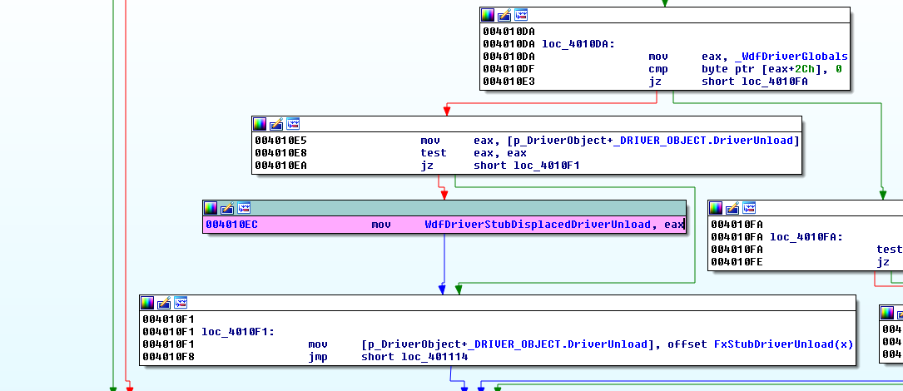

И также программа перезаписывает поле **DRIVERUNLOAD** функцией, которая не является моей и называется **FXSTUBDRIVERUNLOAD** и которая выглядит так если мы её посмотрим.

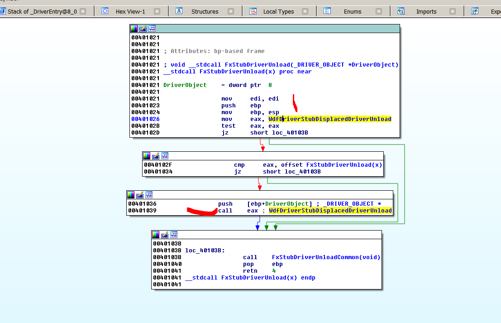

При выгрузке драйвера программа будет переходить в функцию **FXSTUBDRIVERUNLOAD**, но затем загрузит нашу функцию **DRIVERUNLOAD** через переменную **WDFDRIVERSTUBDISPLACEDDRIVERUNLOAD**, так как туда программа сохранила адрес функции. И программа переходит в инструкцию **CALL** **EAX** так же, как и в предыдущем примере, только для того, чтобы сделать немного больше циклов.

В следующей части, мы будем стараться скомпилировать драйвер, который вызывает **IOCTL** из пользовательского режима, зная, что это один из способов эксплуатации драйвера \(И это не единственный способ\)

**=======================================================
Автор текста: Рикардо Нарваха** - **Ricardo** **Narvaja** \(**@ricnar456**\)
Перевод на русский с испанского: **Яша\_Добрый\_Хакер\(Ростовский фанат Нарвахи\).**
Перевод специально для форума системного и низкоуровневого программирования — **WASM.IN
21.10.2018
Версия 1.0**
